[[🧰Mermaid]]は、テキスト形式で図を記述するライブラリである。

## フローチャート
ノード（○や□）とエッジ（矢印や線）で構成されるチャート図。  
1行目に`flowchart`または`graph`と入力し、スペースを挟んでから配置方向`TB`、`LR`等を入力する。その後はノード名を宣言した上で、繋ぎたいノードを線`--`か矢印`-->`で結ぶ。

### ノード
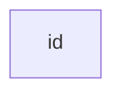

### テキスト付きのノード
テキストの文章を`""`で囲むと、unicodeテキストを使うことができる。
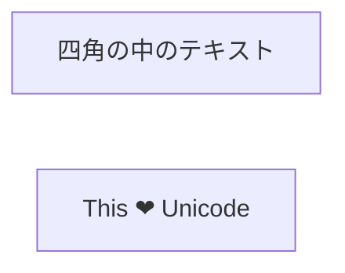
また、テキストの文章を```"``"```で囲むと、中のテキストを[[🧰マークダウン記法]]で書くこともできる。ただし取り消し線やハイライトなどの装飾は使えない。
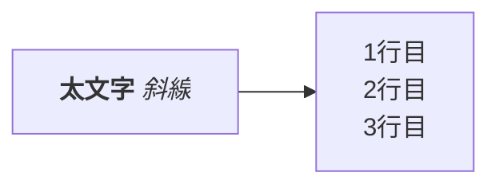
## 方向
`flowchart`の次に方向を指定することで、フローチャートの流れる向きを指定できる。
### `TB`・`TD`で上から下（Top to Bottom、Top-Down）
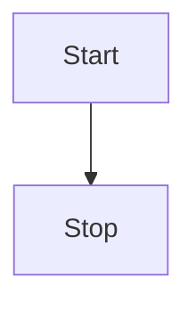
### `LR`で左から右（Left-Right）

### `BT`で下から上（Bottom to Top）
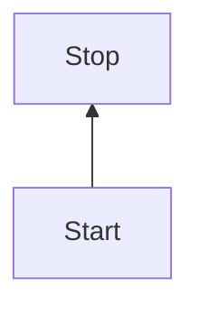
### `RL`で右から左（Right-Left）

## ノードの形
### 角丸`()`
テキストを`()`で囲むと、ノードの形が角丸になる。

### 丸`([])`
テキストを`([])`で囲むと、ノードの形は円に近い角丸になる。

### サブルーチン`[[]]`
テキストを`[[]]`で囲むと、両端に２本の線が入った四角になる。
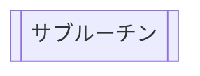
### 円筒形`[()]`
テキストを`[()]`で囲むと、ノードが円筒形になる。
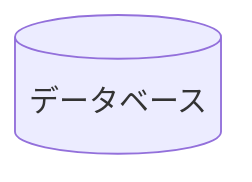
### 円`(())`
テキストを`(())`で囲むと、ノードが円形になる。
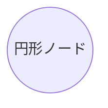
### 非対称のノード`>]`（開発中機能？）
テキストを`>]`で囲むと、ノードが栞のような形になる。現在はこの形しかできないが、将来的には他の形にもできるように機能が実装される予定らしい。[^将来的機能]


[^将来的機能]: [Flowcharts Syntax | Mermaid](https://mermaid.js.org/syntax/flowchart.html#a-node-in-an-asymmetric-shape)

### 菱形のノード`{}`
テキストを`{}`で囲むと、ノードが菱形になる。
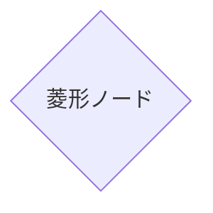
### 六角形のノード`{{}}`
テキストを`{{}}`で囲むと、ノードが六角形になる。

### 平行四辺形のノード`[//]`
テキストを`[//]`で囲むと、ノードが平行四辺形になる。
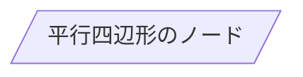
`[\\]`で囲むと、逆方向の平行四辺形になる。
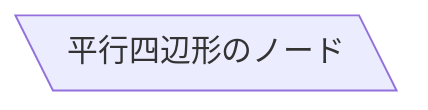
### 台形のノード
テキストを`[/\]`で囲むと、台形のノードになる。
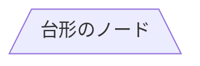
`[\/]`で囲むと、逆方向の台形になる。
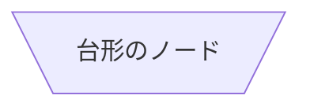
### 二重線の円ノード
テキストを`((()))`で囲むと、二重線の円ノードになる。
```mermaid
flowchart TD
    id1(((二重線の円ノード)))
```
## エッジ
### 矢印`-->`
ノード間を`-->`で結ぶと、ノードを表記通りの矢印で結ぶ。**矢印を逆向きに結ぶことはできない。**
```mermaid
flowchart LR
    A-->B
```
### 線`---`
ノード間を`---`で結ぶと、ノードを線で結ぶ。
```mermaid
flowchart LR
    A --- B
```
### テキスト付きの矢印`-- text -->`、`-->|text|`
`-- text -->`または`-->|text|`を入れて結ぶと、ノードをテキスト付きの矢印で結ぶ。
```mermaid
flowchart LR
    A-- テキスト付き -->B-->|テキスト付き|C
```
### テキスト付きの線`-- text --`、`---|text|`
`-- text --`または`---|text|`を入れて結ぶと、ノードをテキスト付きの線で結ぶ。
```mermaid
flowchart LR
    A-- テキスト付き ---B---|テキスト付き|C
```
### 点線矢印`-.->`
ノード間を`-.->`で結ぶと、ノードを点線矢印で結ぶ。
```mermaid
flowchart LR
   A-.->B;
```
### 太い矢印` => `
ノード間を` => `で結ぶと、ノードを太い矢印で結ぶ。
```mermaid
flowchart LR
   A ==> B
```
### テキスト付きの太い矢印` == text ==>`
ノード間を` == text ==>`で結ぶと、ノードをテキスト付きの太い矢印で結ぶ。
```mermaid
flowchart LR
   A == テキスト ==> B
```
### 見えない線 `~~~`
ノード間を`~~~`で結ぶと、ノードを見えない線で結ぶ。
```mermaid
flowchart LR
    A ~~~ B
```
### エッジの連結
ノード間を複数のエッジで連結することもできる。
```mermaid
flowchart LR
   A -- テキスト１ --> B -- テキスト２ --- C
```
### 複数のノードへの分岐、集約
ノードを`&`で結ぶことで、一つのノードから複数へのノードへの分岐もできる。`&`で結んだノード群を一つのノードに結ぶことで、集約もできる。
```mermaid
flowchart LR
   a --> b & c --> d
```
同じ図を書く場合でも、表記が異なる場合がある。その場合は自分にとってわかりやすい方を選ぶと良い。
```mermaid
flowchart TB
    A & B--> C & D
```
```mermaid
flowchart TB
    A --> C
    A --> D
    B --> C
    B --> D
```
### 丸エッジ`--o`
ノードを`--o`で結ぶと、ノードを終端が丸い形の線で結ぶ。
```mermaid
flowchart LR
    A --o B
```
### バツエッジ`--x`
ノードを`--x`で結ぶと、ノードを終端がバツの形の線で結ぶ。
```mermaid
flowchart LR
    A --x B
```
### 双方向のエッジ
ノードを`o--o`、`<-->`、`x--x`で結ぶと、ノードを双方向の線で結ぶ。
```mermaid
flowchart LR
    A o--o B
    B <--> C
    C x--x D
```
## リンクの最小長
エッジの線の本数を増減させることで、フローチャートの線の長さを変えることができる。太線の場合は` = `、 点線の場合は`.`を増減させる。
```mermaid
flowchart TD
    A[スタート] --> B{本当?}
    B -->|はい| C[OK]
    C --> D[もう一度考える]
    D --> B
    B ---->|いいえ| E[エンド]
```
## サブグラフ
```
subgraph title
    graph definition
end
```
`subgraph`と`end`で囲むことで、サブグラフを描画することができる。
```mermaid
flowchart TB
    c1-->a2
    subgraph one
    a1-->a2
    end
    subgraph two
    b1-->b2
    end
    subgraph three
    c1-->c2
    end
```
### サブグラフのエッジ
サブグラフ同士をエッジで結ぶこともできる。また、サブグラフとノードを結ぶことも可能。
```mermaid
flowchart TB
    c1-->a2
    subgraph one
    a1-->a2
    end
    subgraph two
    b1-->b2
    end
    subgraph three
    c1-->c2
    end
    one --> two
    three --> two
    two --> c2
```
### サブグラフ内の方向
`subgraph`内で`direction`を設定すると、サブグラフ内の方向を設定できる。たとえば、`direction TB`で上から下へ、`direction RL`で左から右へ方向を設定できる。
```mermaid
flowchart LR
  subgraph TOP
    direction TB
    subgraph B1
        direction RL
        i1 -->f1
    end
    subgraph B2
        direction BT
        i2 -->f2
    end
  end
  A --> TOP --> B
  B1 --> B2
```
## コメント
文字の先頭に`%% `と置くと、その行はコメントとみなされ、無視される。
```mermaid
flowchart LR
%% これはコメントです。 A -- text --> B{node}
   A -- テキスト --> B -- テキスト2 --> C
```
