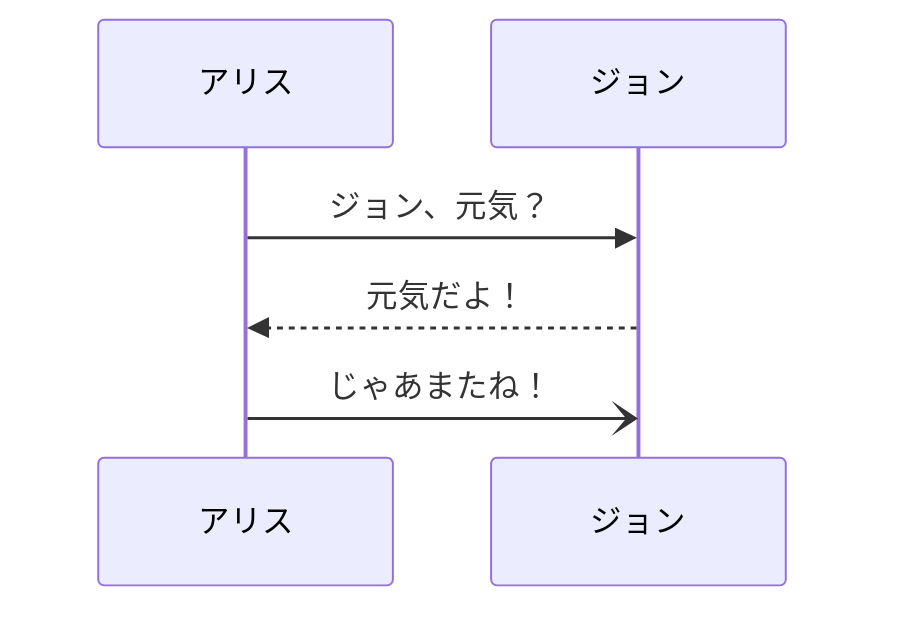
```mermaid
sequenceDiagram
	アリス->>ジョン: ジョン、元気？ 
	ジョン-->>アリス: 元気だよ！
	アリス-)ジョン: じゃあまたね！
```
シーケンス図の勉強と[[🧰Mermaid]]の練習を兼ねたメモ。

## 登場人物(participant)・アクター(Actor)
`participant`を宣言すると、シーケンス図上下の四角形が設定できる。
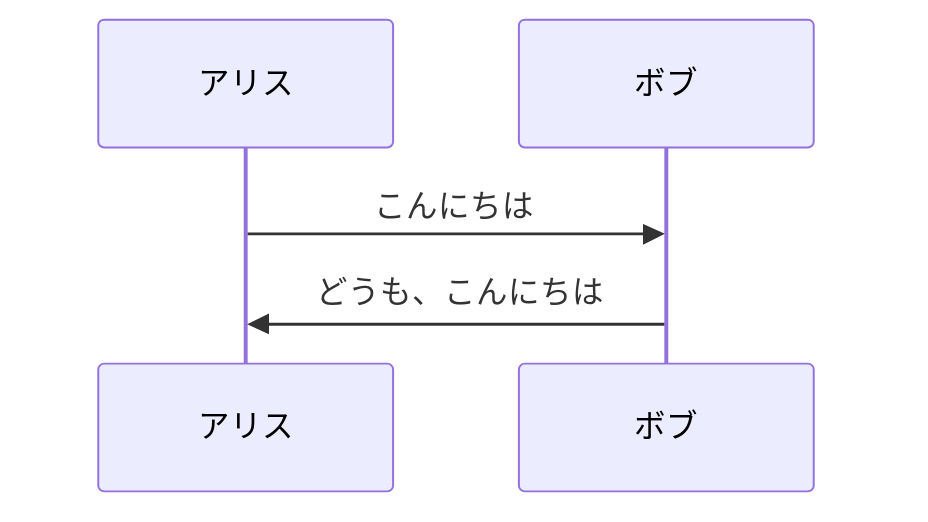
```mermaid
sequenceDiagram
	participant アリス
	participant ボブ
	アリス->>ボブ: こんにちは
	ボブ->>アリス: どうも、こんにちは
```

`actor`と宣言すれば、人の形で表すこともできる。
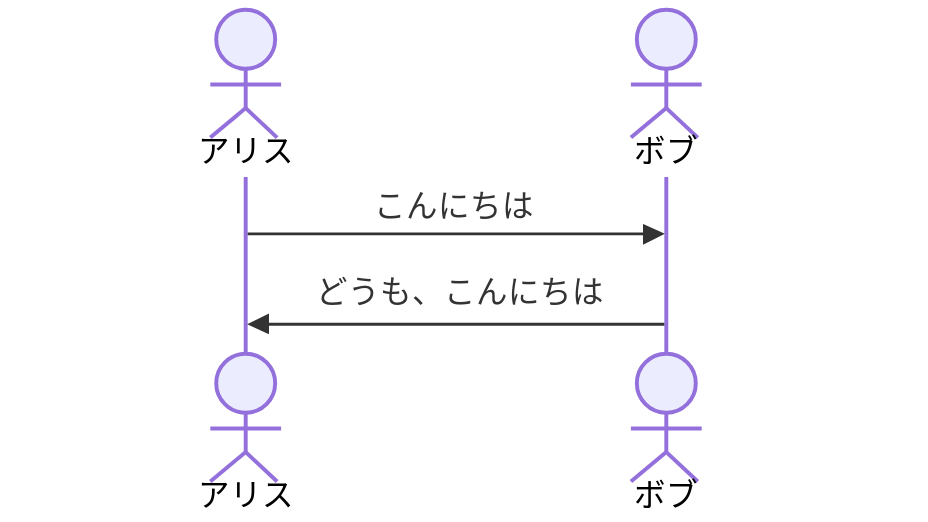
```mermaid
sequenceDiagram
	actor アリス
	actor ボブ
	アリス->>ボブ: こんにちは
	ボブ->>アリス: どうも、こんにちは
```

## エイリアス（alias）
登場人物・アクター名に`as (名前)`をつけることで、宣言名とは別の名前を付けることができる。以下の図では、登場人物としてアリスとボブが存在するが、それぞれ宣言名はAとBである。

```mermaid
sequenceDiagram
	participant A as アリス
	participant B as ボブ
	A->>B: こんにちは
	B->>A: どうも、こんにちは
```

## 登場人物・アクターの新規作成・破棄
シーケンスの途中で、登場人物・アクターの新規追加と破棄ができる。`create participant (名前)`で登場人物、`create actor (名前)`でアクターが追加できる。
`destroy (既存の名前)`で既存の登場人物・アクターを破棄できる。

>[!info] 注意
>登場人物・アクターを宣言しないまま`delete`を行うと、Mermaidはパース処理に失敗する。そして一度失敗するとそれ以降、Mermaidの全てのパース処理が*必ず*失敗してしまうという不具合がある。[^エラー]そうなった時は、アプリケーションを閉じてもう一度開き直すこと。

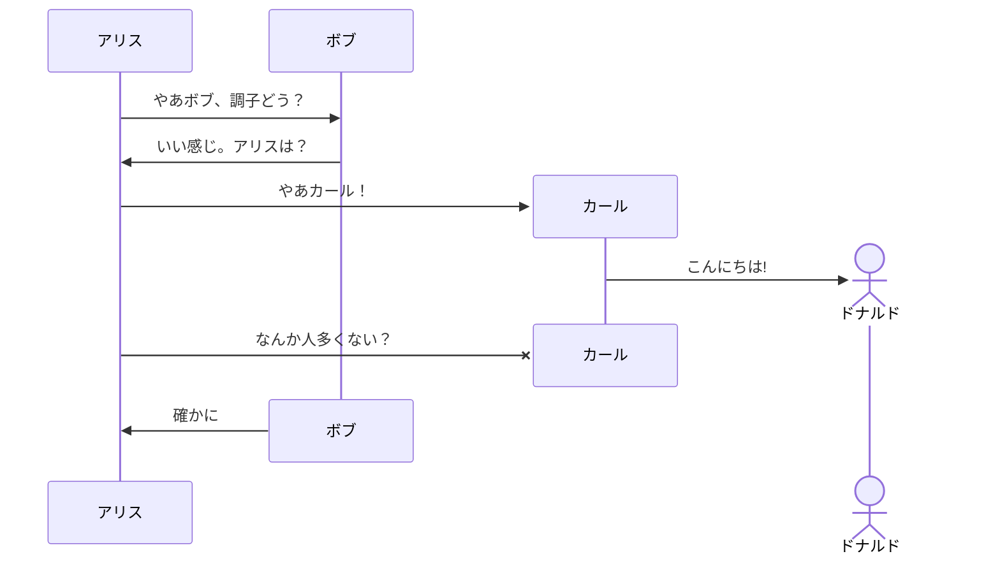
```mermaid
sequenceDiagram
    アリス->>ボブ: やあボブ、調子どう？
    ボブ->>アリス: いい感じ。アリスは？
    create participant カール
    アリス->>カール: やあカール！
    create actor D as ドナルド
    カール->>D: こんにちは!
    destroy カール
    アリス-xカール: なんか人多くない？
    destroy ボブ
    ボブ->>アリス: 確かに
```

[^エラー]: [Sequence Diagram - Create and Destroy Directives break if syntax is not exactly right · Issue #4833 · mermaid-js/mermaid · GitHub](https://github.com/mermaid-js/mermaid/issues/4833)

## グループ化・ボックス化
アクターを`box (背景色) (グループの説明)`と`end`で囲むと、グループでまとめることもできる。背景色は`Aqua`、`Purple`等の色名で指定するほか、`rgb(r,g,b)`で設定することも可能。また、省略してもいい。
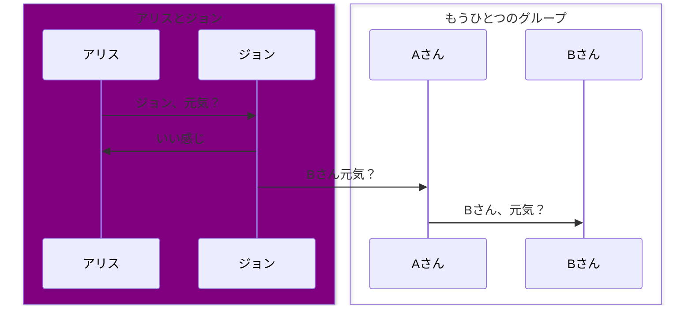
```mermaid
sequenceDiagram
	box Purple アリスとジョン
	participant アリス
	participant ジョン
	end
	box もうひとつのグループ
	participant Aさん
	participant Bさん
	end
	アリス->>ジョン: ジョン、元気？
	ジョン->>アリス: いい感じ
	ジョン->>Aさん: Bさん元気？
	Aさん->>Bさん: Bさん、元気？	
```

## メッセージ
登場人物やアクター同士のやり取りは矢印で表す。
### 直線`->`と点線`-->`
直線・点線でやり取りする。UMLシーケンス図で使う場面はないらしい。
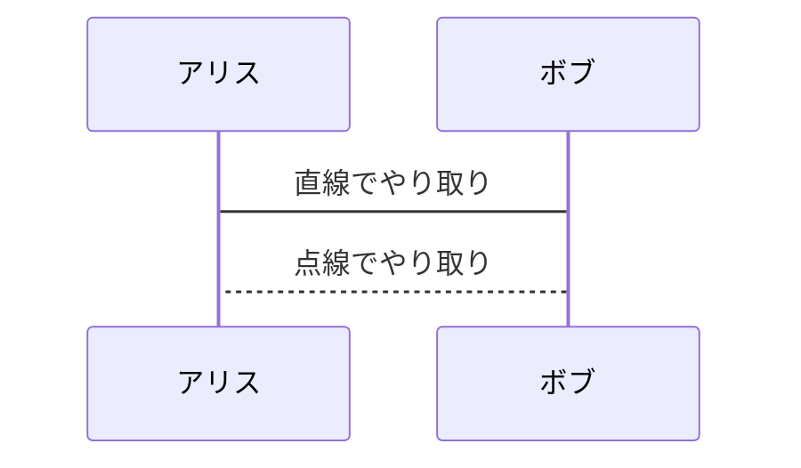
```mermaid
sequenceDiagram
	participant アリス
	participant ボブ
	アリス->ボブ: 直線でやり取り
	ボブ-->アリス: 点線でやり取り
```
### 同期メッセージ`->>`と応答`-->>`
矢印でやり取りする。直線の矢印は同期メッセージ、点線の矢印は同期の応答メッセージを表す。
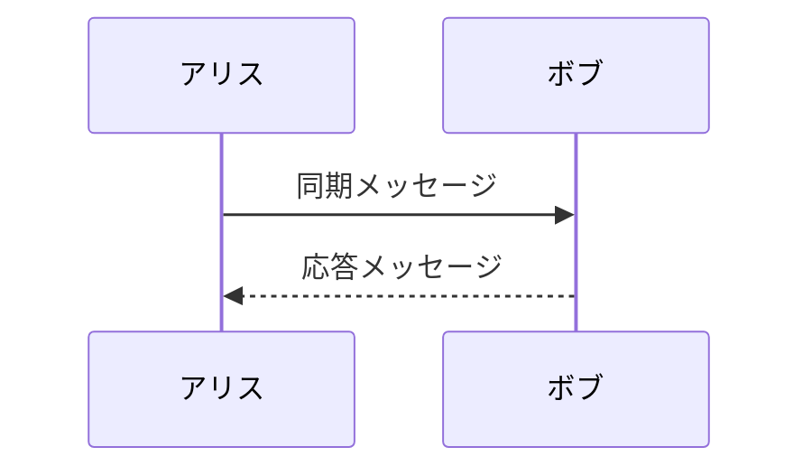
```mermaid
sequenceDiagram
	participant アリス
	participant ボブ
	アリス->>ボブ: 同期メッセージ
	ボブ-->>アリス: 応答メッセージ
```
### ×矢印`-x`とx点線矢印`--x`
メッセージ先にバツ印のついた矢印で応答する。UMLシーケンス図で使う場面はない。
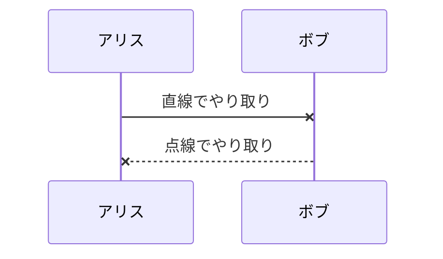
```mermaid
sequenceDiagram
	participant アリス
	participant ボブ
	アリス-xボブ: 直線でやり取り
	ボブ--xアリス: 点線でやり取り
```
### 非同期メッセージ`-)`と非同期応答`--)`
矢頭が直線の矢印で応答する。
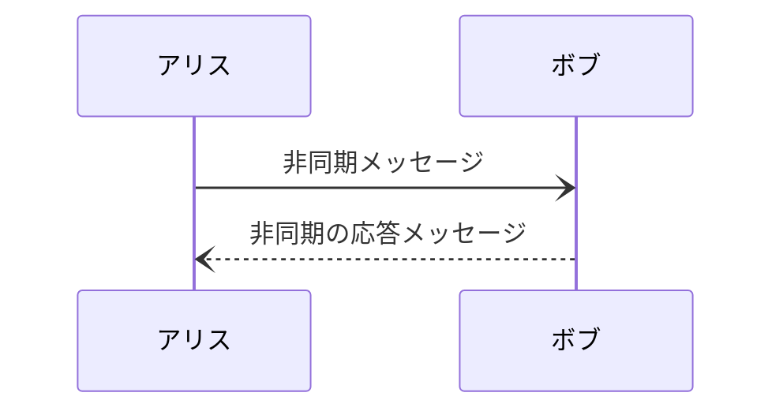
```mermaid
sequenceDiagram
	participant アリス
	participant ボブ
	アリス-)ボブ: 非同期メッセージ
	ボブ--)アリス: 非同期の応答メッセージ
```

## アクティベーション
`activate (登場人物名)`と宣言すると、登場人物にアクティベーションボックスを追加する。`deactivate (登場人物名)`でアクティベーションボックスを解除する。
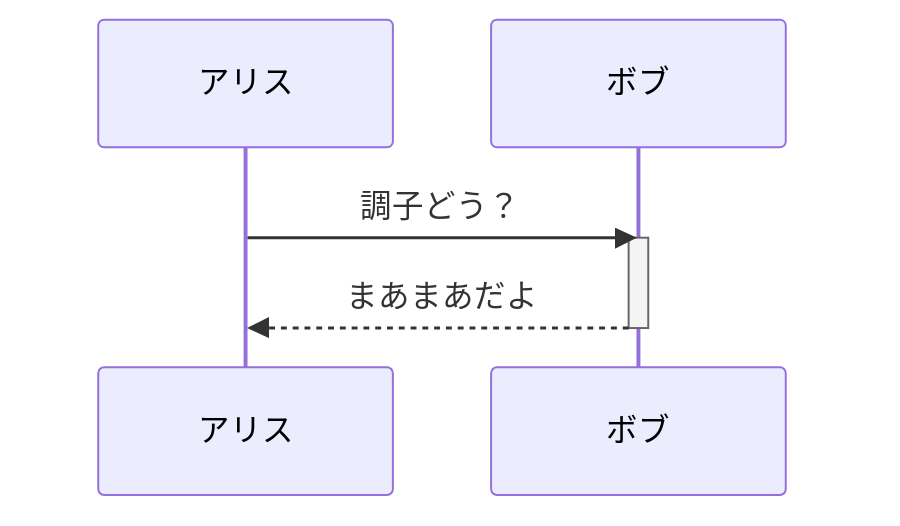
```mermaid
sequenceDiagram
	アリス->>ボブ: 調子どう？
	activate ボブ
	ボブ-->>アリス: まあまあだよ
	deactivate ボブ
```
`activate`、`deactivate`と宣言しなくても、矢印の末端に`+`、`-`を加えて`->>+`、`-->>-`とすることで、手軽にアクティベーションボックスの追加・解除ができる。
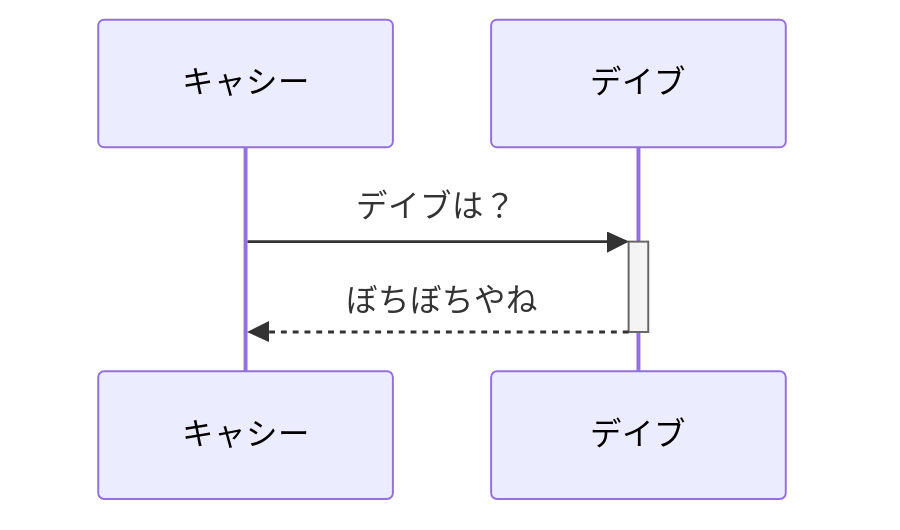
```mermaid
sequenceDiagram
	キャシー->>+デイブ: デイブは？
	デイブ-->>-キャシー: ぼちぼちやね
```
アクティベーションボックスは積み重ねて配置することもできる。
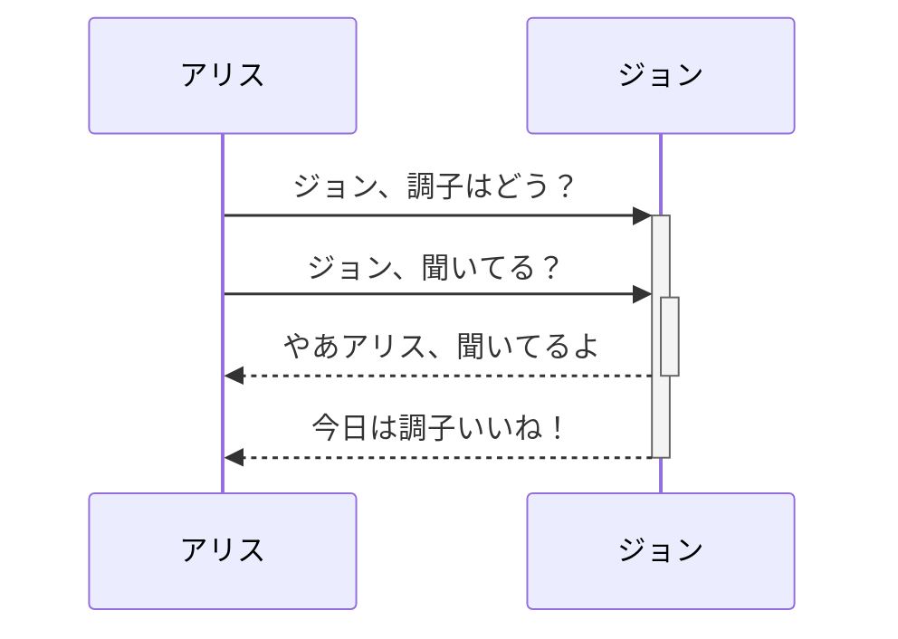
```mermaid
sequenceDiagram
    アリス->>+ジョン: ジョン、調子はどう？
    アリス->>+ジョン: ジョン、聞いてる？
    ジョン-->>-アリス: やあアリス、聞いてるよ
    ジョン-->>-アリス: 今日は調子いいね！
```
## メモ
登場人物・アクターの近くにメモを配置することもできる。
- 左: `note right of (登場人物名)`
- 右: `note left of (登場人物名)`
- 中央: `note over (登場人物名)`
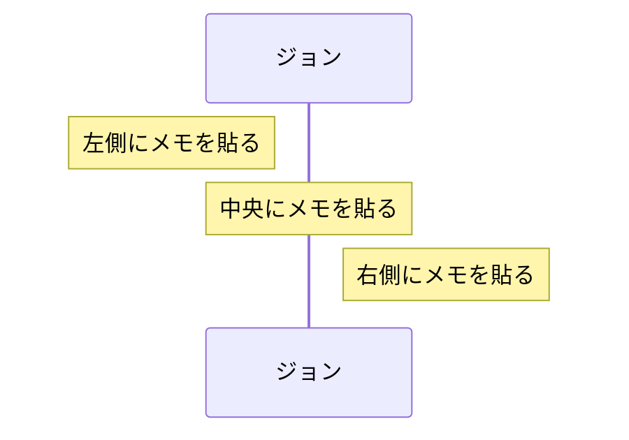
```mermaid
sequenceDiagram
	participant ジョン
	note left of ジョン: 左側にメモを貼る
	note over ジョン: 中央にメモを貼る
	note right of ジョン: 右側にメモを貼る
```
中央に配置する場合、複数の登場人物を跨いでメモを配置することもできる。
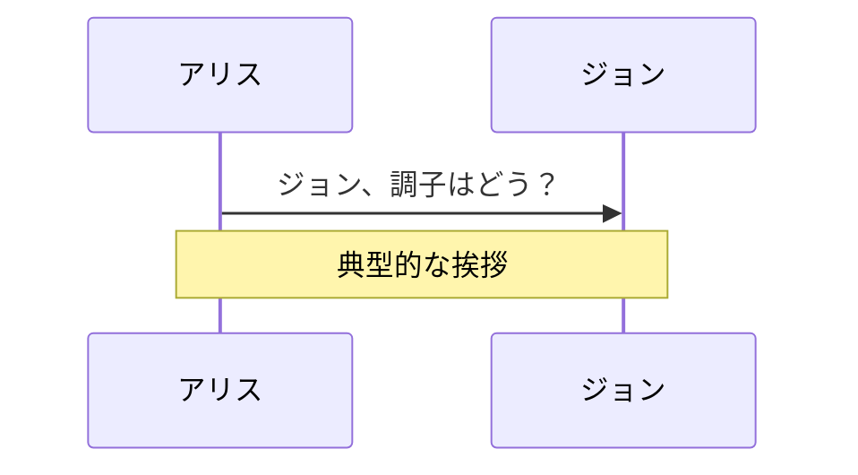
```mermaid
sequenceDiagram
	participant アリス
	participant ジョン
	アリス->>ジョン: ジョン、調子はどう？
	note over アリス,ジョン: 典型的な挨拶
```
## ループ(Loop)
`loop (ループ名)`と`end`で囲むと、囲んだ部分をループとして表せる。
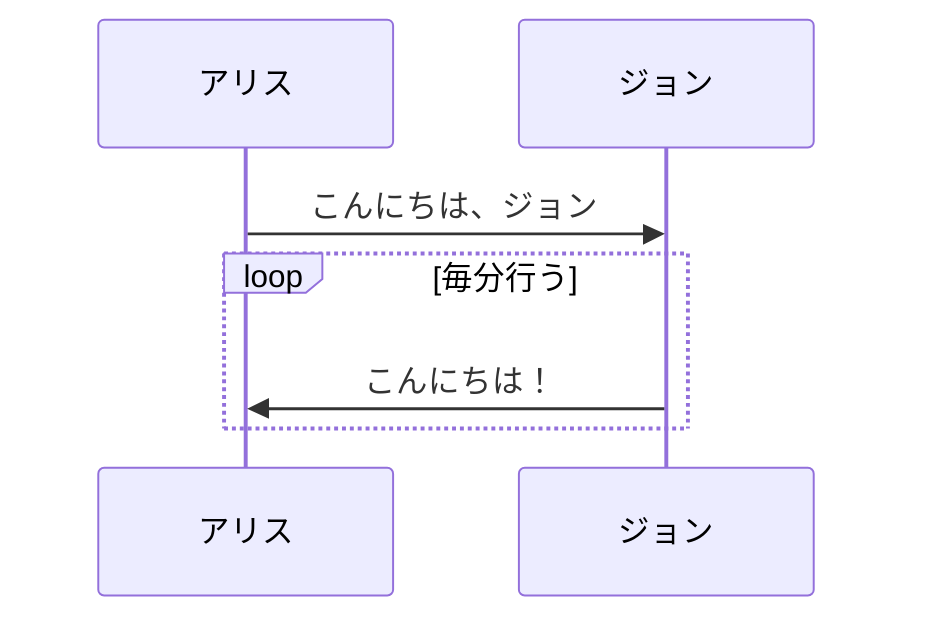
```mermaid
sequenceDiagram
	アリス->>ジョン: こんにちは、ジョン
	loop 毎分行う
		ジョン->>アリス: こんにちは！
	end
```
## オプションと条件分岐(Opt、Alt)
`alt (条件名)`と`end`で囲むと、囲んだ部分を代替記号として表せる。これはif文のような条件分岐を表現する際に使う。`alt`の間に`else (条件名)`を加えると、別の選択肢を表せる。
なお、`else`が必要ない場合は、`opt (条件名)`と`end`で囲む。`opt`内で`else (条件名)`を加えることはできない。
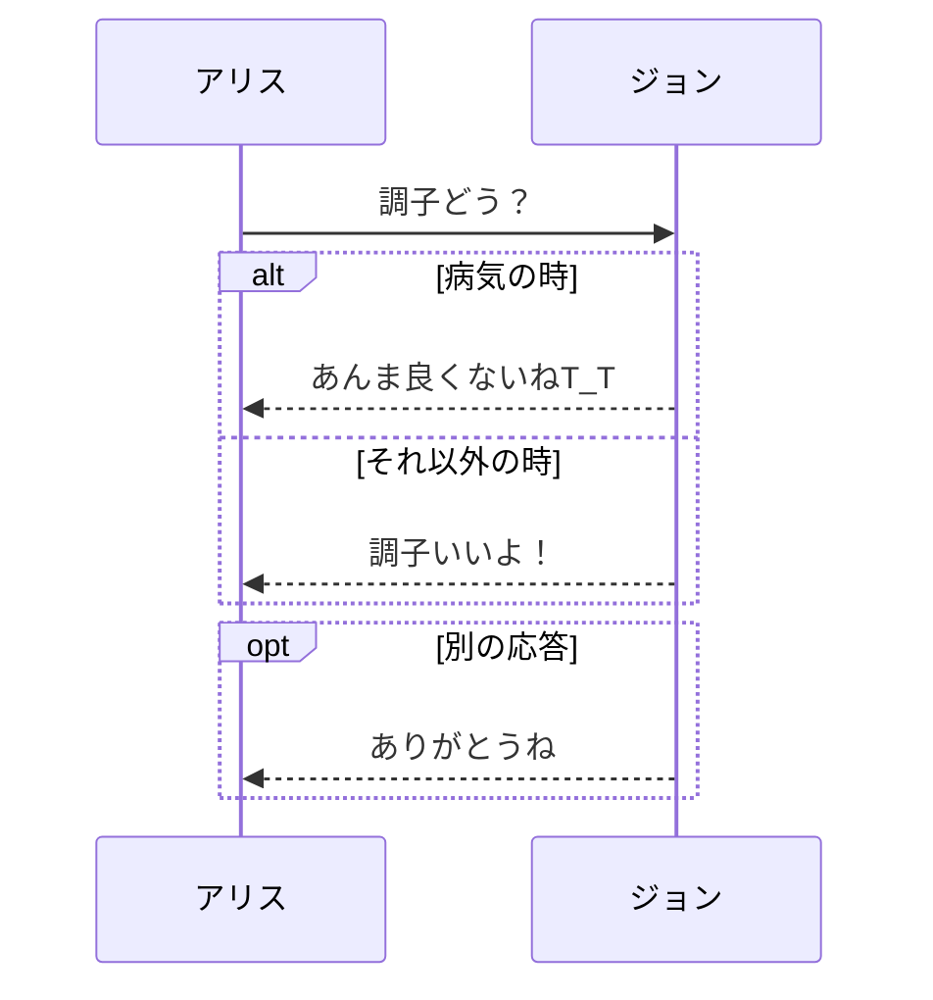
```mermaid
sequenceDiagram
	アリス->>ジョン: 調子どう？
	alt 病気の時
		ジョン-->>アリス: あんま良くないねT_T
	else それ以外の時
		ジョン-->>アリス: 調子いいよ！
	end
	opt 別の応答
		ジョン-->>アリス: ありがとうね
	end
```

## 並列(Parallel)
`par [並列行動名]`と`end`で囲むと、囲んだ部分を並列処理として表せる。`par`の間に`and [別の並列行動名]`を加えると、並列して行う行動を表せる。
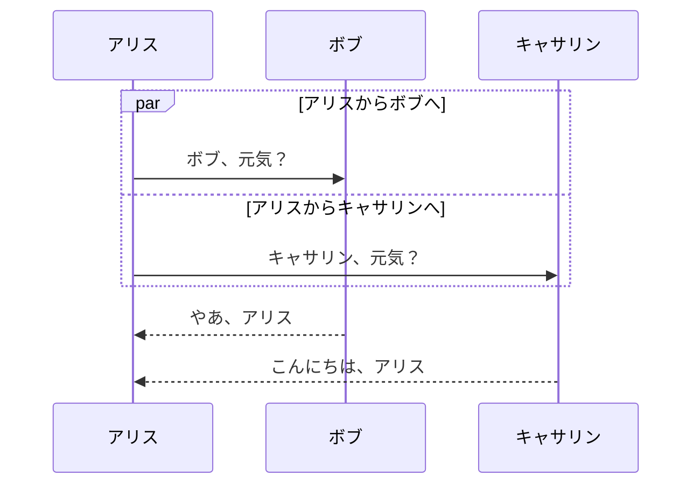
```mermaid
sequenceDiagram
	par アリスからボブへ
	アリス->>ボブ: ボブ、元気？
	and アリスからキャサリンへ
	アリス->>キャサリン: キャサリン、元気？
	end
	ボブ-->>アリス: やあ、アリス
	キャサリン-->>アリス: こんにちは、アリス
```
並列処理はネストすることも可能。
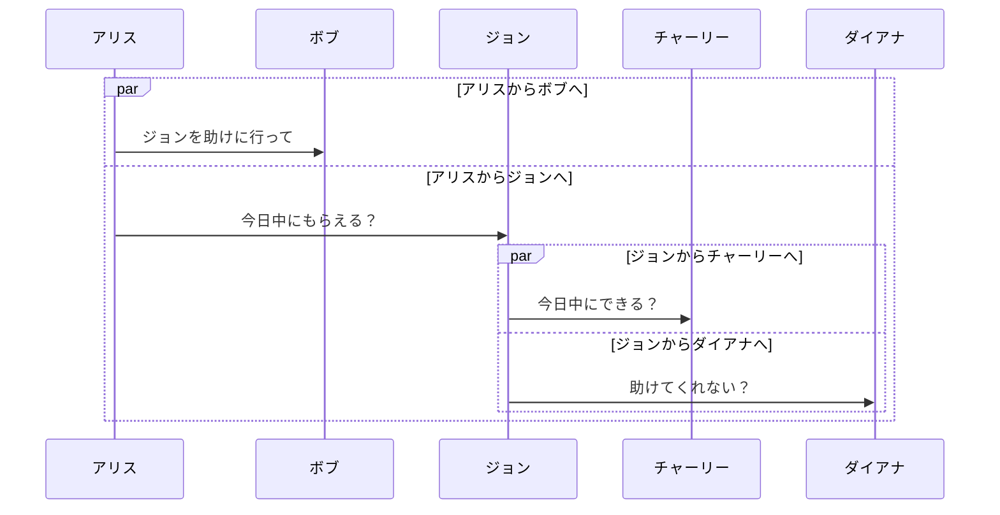
```mermaid
sequenceDiagram
	par アリスからボブへ
	アリス->>ボブ: ジョンを助けに行って
	and アリスからジョンへ
	アリス->>ジョン: 今日中にもらえる？
		par ジョンからチャーリーへ
			ジョン->>チャーリー: 今日中にできる？
		and ジョンからダイアナへ
			ジョン->>ダイアナ: 助けてくれない？
		end
	end
```
## 重要(Critical)
`critical [重要行動名]`と`end`で囲むと、囲んだ部分を重要行動として表せる。また、並列処理と同じくネストもできる。シーケンス図において使う機会はあまりなさそうなので、予備知識として覚えておくと良いかも。
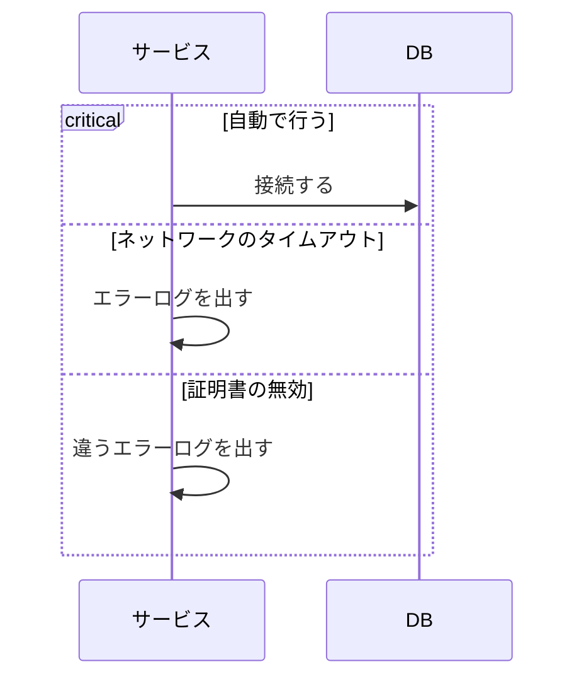
```mermaid
sequenceDiagram
	critical 自動で行う
		サービス->>DB: 接続する
	option ネットワークのタイムアウト
		サービス->>サービス: エラーログを出す
	option 証明書の無効
		サービス->>サービス: 違うエラーログを出す
	end
```
選択肢がない状態でも表せる。
```mermaid
sequenceDiagram
	critical 自動で行う
		サービス->>DB: 接続する
	end
```
## 例外(Break)
`break [例外処理名]`と`end`で囲むと、囲んだ部分が例外処理として表せる。こちらもシーケンス図で使う機会はあまりなさそう。
```mermaid
sequenceDiagram
	ユーザ-->API: 何かしら予約する
	API-->予約サービス: 予約処理を開始
	break 予約処理が失敗した時
		API-->ユーザ: 失敗メッセージを表示
	end
	API-->決済サービス: 決済処理を開始
```
