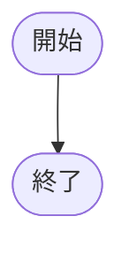
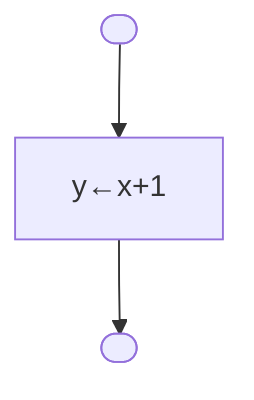
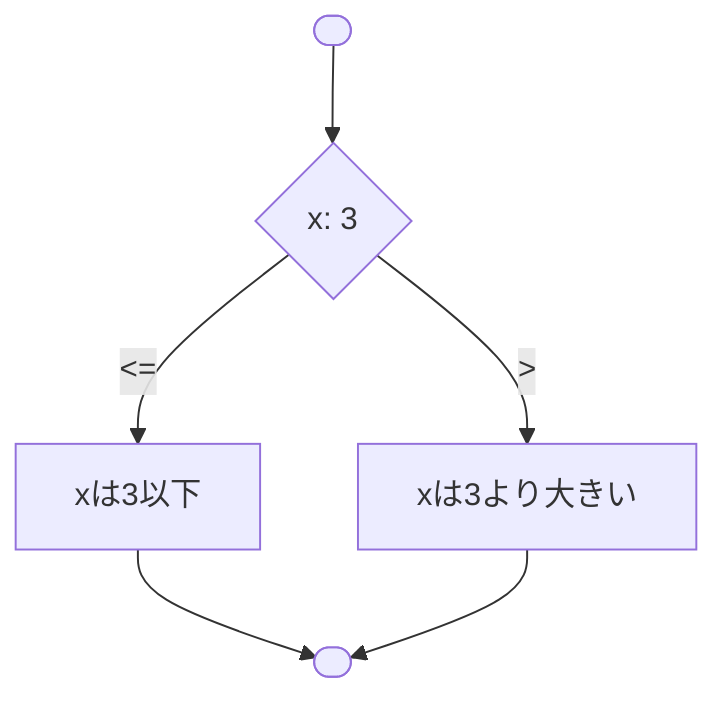
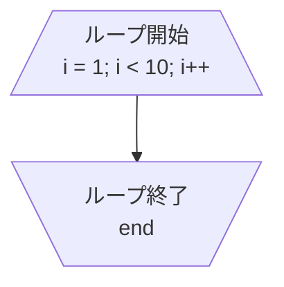
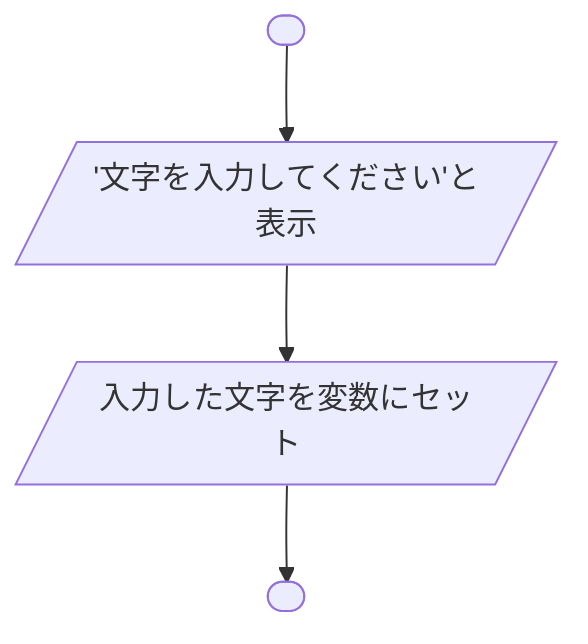
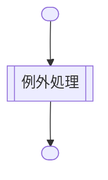
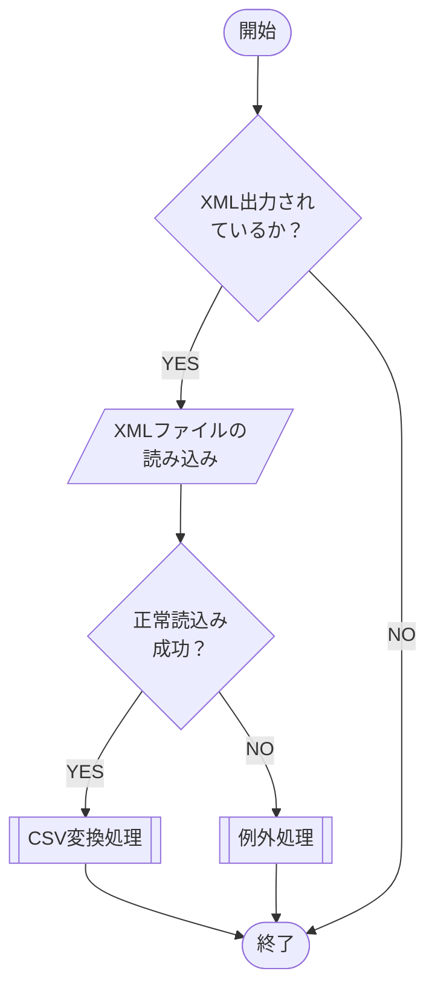

# フローチャートで使う記号
フローチャートの勉強と[[🧰Mermaid]]の練習を兼ねたメモ。

## 端子記号（開始・終了）
プロセスの開始と終了を表す。

## 処理記号（プロセス）
演算処理やデータの形を変換する処理を表す。

## 判断記号（条件分岐）
条件を判断して、以降の処理の流れを分岐させる判断処理を示す。

## ループ端
繰り返しの処理を行うループの始まりと終わりを表す。ループ開始端の2行目にはループの条件を記入する。

## 入出力（データ）
外部データの参照や外部データへの書き込み、ファイルの入出力などを表す。

## 定義済み処理（サブルーチン）
別のフローチャート等で定義されている処理を表す。定義済み処理名を記入する。

## フローチャートの例
