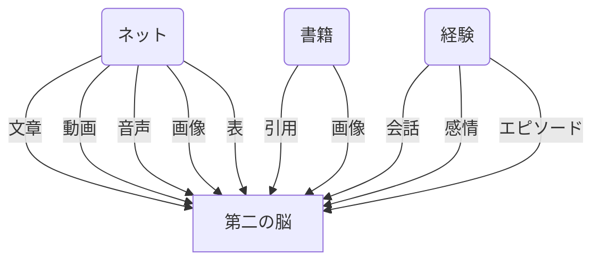
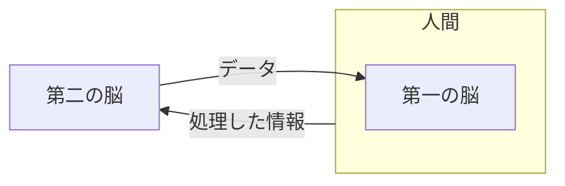
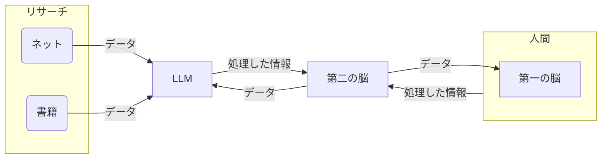
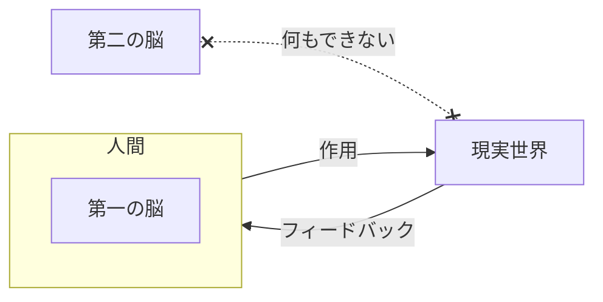
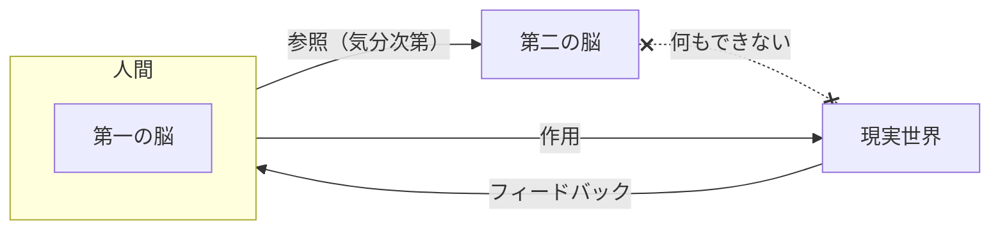
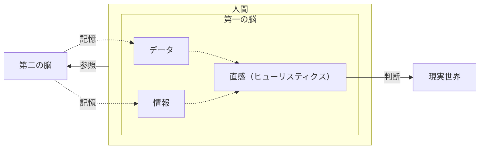

> [!info]
> この記事は『Obsidianアドベントカレンダー2025』8日目の記事です。

![[情報処理は時間と労力がかかる.webp]]

私はObsidianで新しいテキストを書くとき、まずはなにも見ないで書くようにしています。途中で行き詰まるか書き上げるまでは、資料も検索エンジンも使いません。自分の頭から絞り出して、とにかく思い出せるものを書き出します。

このやり方は、勉強法・思考法のひとつである「ブレインダンプ（Brain Dumping）」を参考にしています。これは特定の事柄を学ぶときに、まずは自分の頭にあるものをすべて書き出すという手法です。ブレインダンプは自分の中で理解があいまいな部分や、誤解している部分を明らかにします。そのため、自分の理解度を確認するときに便利なのです。

一方で生産性から見ると、ブレインダンプは効率が悪く、手間のかかる手段です。自分の記憶だけを頼りに文章を書くため、書き上げるまでに時間がかかります。そのうえ、書き上げたテキストは勘違いや説明不足が多いものになります。あとで資料を確認して、間違っているところを修正しなければなりません。そもそもテキストを正確にしたいのであれば、自力で文章を書き出すよりも、資料を見ながら書くほうが楽です。

では何のために、こんな効率の悪いやり方で文章を書くのか？　「第一の脳を育てるために」です。

## 「第二の脳」と「第一の脳」
デジタルツールを使って、自分専用のデータベースやWiki、データの保管庫（Vault）を作り上げる。Tiago Forte[^2]氏はこうした情報の一元管理システムを「[第二の脳（Second Brain）](https://www.buildingasecondbrain.com/)」と表現しました。Obsidianはマークダウンエディタですが、第二の脳を構築するデジタルツールとしても活かせるポテンシャルがあります。

しかし、第二の脳を育てるには苦労がつきものです。第二の脳に入れたデータを分析・処理して、役に立つ情報へと昇華させる。そのためには人間の頭脳を使うほかありません。（この記事では人間の頭脳を、第二の脳と対比して「第一の脳」と呼びます）

第一の脳による情報処理は、認知能力と時間をかなり費やします。そのうえ、必ずしも苦労に見合う情報が得られるとは限りません。報酬は神のみぞ知る状態です。私はモノグサな人間なので、費やす時間や労力と比べて、得られる報酬が割に合わないと、つい面倒くささを感じてしまいます。

（その代わり、ネットや書籍からのデータ収集に時間と労力を費やしはじめます。こうして第二の脳が未処理のデータで埋め尽くされていきます）

第二の脳を育てるには、第一の脳を酷使しなければならない。これは知的生産の向上を目指す人々につきもののツラさでした。少なくとも2024年までは。

## LLMが「第一の脳」を肩代わりする？
2022年、OpenAIが発表したChatGPTを皮切りに、LLM（大規模言語モデル）が台頭しました。どんな質問にも人間そっくりの応答を返す驚きのチャットボット。しかし当時はまだ、面白いオモチャが現れたという印象でした。

ところが2024年、LLMに推論・リサーチ機能がつきました。LLMはついに人間の代わりに情報を収集・分析・処理してくれるようになったのです。しかもその機能は2025年時点では、無料のサービスとして使えます。（使用回数等の制限はありますが）

ユーザーが質問をポンと投げかけるだけで、LLMは広いネットから目的のデータを見つけ出します。さらには1〜2分で読める文章に圧縮して出力してくれます。同じ作業を人間がやれば数時間〜数日はかかりますが、LLMはこれをたった数分でやり遂げます。

第一の脳の知的能力をほかの外部装置に任せる。これは過去に何度も繰り返されてきました。人間は情報の記憶を本に託し、数値の計算を電子計算機に託してきました。そして2025年現在は、情報の分析・処理をLLMに託せるようになったのです。

これは福音だ！　これまで第一の脳でしかできなかったことを、LLMが肩代わりしてくれる！　AIエージェントを使えば、第二の脳に保存したデータを全自動で24時間処理することもできるかもしれない！　これで知的生産が爆速化！　溜めたメモを資産に変えましょう！　いますぐ使えるプロンプト10選！　~~↓詳しくは固ツイ↓~~

しかし、このような「爆速知的生産術」はうまくいきません。なぜなら第二の脳だけでは、現実世界に影響を及ぼすことができないからです。

## 「第二の脳」だけでは現実を変えられない

現実世界に影響を及ぼすには、物理的な実体が必須です。第一の脳と第二の脳の決定的な違いは、自由に動かせる手足を持つか否かです。

たとえばコーヒーが飲みたいとき。第一の脳には人間の手足がついています。なので、自分の足を使ってキッチンまで行き、自分の手を使ってコーヒーを淹れることができます。これは日常的な所作ですが、それでも第一の脳は自分の手足を使って、現実世界に不可逆な影響を及ぼしているといえます。

しかし、第二の脳は概念上の存在です。物理的実体を持ちません。データが保存されているデジタル端末や企業のサーバは、あるいは物理的実体と呼べるかもしれません。しかしスマートフォンやサーバは単独でキッチンまで歩けませんし、コーヒーも淹れられません。現実世界に影響を及ぼせる存在ではないのです。

第二の脳が現実に影響を及ぼすには、かならず人間の手助けが必要になります。つまり第一の脳の仲介です。

## 仲介者としての「第一の脳」

第二の脳と現実世界。このふたつの間を仲介できる存在は、今のところ人間だけです。（将来ロボティクス産業が進展すれば、第二の脳がロボットの手足を獲得する未来もあるかもしれません）

それならば人間には、両者の間をうまく取り持つ仲介者の役割が求められます。第二の脳から得た知見を現実世界で実践して、得られたフィードバックを第二の脳に伝える役割です。

しかし、人間は非合理的な生き物です。ロジックで積み上げた最適解よりも、手間のかからない解決策を好みます。楽をするためにつくった第二の脳を、楽をするために無視することを好みます。本末転倒です。

そんな非合理的な生き物に、現実世界と第二の脳との仲介役をまっとうさせるには、どうすればよいでしょう。

## 「第一の脳」を育てるとは、直感を育てること

理想的なのは、第二の脳にある情報を第一の脳にも覚えてもらうことです。つまり第一の脳と第二の脳を同期させることです。第一の脳から情報を引き出せるならば、すばやい行動や判断が楽にできるようになります。

しかし、人間の脳は忘れやすいうえ、情報を正しく覚えるまでに時間がかかります。その欠点を補うために、私たちは第二の脳をつくっているわけです。

なので第一の脳には、いま必要なデータや情報だけを覚えてもらいます。細かい数値や文言の記憶、データの場所については第二の脳に任せましょう。

代わりに第一の脳に求めるのは、直感です。第二の脳から記憶した大量のデータから浮かび上がった経験的知識、ヒューリスティクスです。

私たちは現実世界でなにかしらの情報に接したとき、すぐにその情報を判断します。「この情報は重要だ」「ここはいらないな」「なにか変じゃないか？」などなど。こうした判断を生み出しているのは直感です。

第一の脳を育てるとは、直感を育てることです。第一の脳に情報を取り込み、十分な時間をかけてヒューリスティクスを発見してもらい、直感の精度を高めていくことです。

## 「第一の脳」を育てるために……どうしよう？
では、第一の脳に多くの情報を覚えさせるにはどうすればよいか？　それが最初に紹介したブレインダンプなのです！　……と言って、きれいにまとめられたら嬉しかったのですが。実を言うと、私自身も手探りの状態です。

脳に情報を記憶させるために有効な手段は思い出すこと（想起）だと言われています。[^3]なので思い出す機会を増やそうと、私はブレインダンプを実践しています。ただし、これは安直な方法なので、調べればもっと効率的な手段があると思います。

[[👤Herbert Simon]]は「最善策を探し求めるよりも、いま必要な変化を試すほうがいい」と言っています[^1]。その言葉を信じて、第一の脳に覚え込ませる方法を試行錯誤しています。

## まとめ
- LLMの台頭で、第二の脳は効率的に運用できるようになった
- しかし第二の脳を現実に生かすには、第一の脳の仲介が必要
- 第一の脳は理屈を嫌うので、無意識に思い出させよう

[^1]: "... we may not have to know what the best way is but just the change required from what we do now. (...) I do not know the best way to do it, but I do know that we should give people better capabilities for moving around the world, acquiring information."（...私たちは最善の方法が何かを知る必要はなく、今やっていることに求められる変化を知るだけでいいかもしれません。（中略）最善の方法は私にはわかりません。しかし、より良い能力を人々に与えるべきだとはわかっています。世界中を動き回って、情報を獲得するための能力を。）『[[📑Designing Organizations For An Information-rich World]]』より。

[^2]: ティアゴ・フォーテ。1985〜。アメリカの作家・コンサルタント。『Forte Labs』主宰。生産性向上をうたうオンラインコースを提供している。Obsidianユーザの中では、ファイルの分類法である「PARAメソッド」の提唱者としても有名か。

[^3]: [What is retrieval practice?](https://www.retrievalpractice.org/why-it-works)を参照。