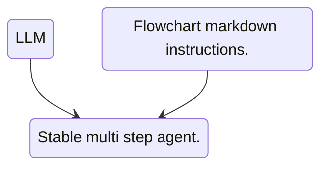

[[👤深津貴之]]氏が提案したChatGPTのカスタムプロンプト。複数のステップからなるタスク処理を、自然言語ではなく[[🧰Mermaid]]のダイアグラム（状態遷移図）を使って表現する。  
ChatGPTの挙動をループ処理や条件分岐で律することができるため、ユーザが細かく指示しなくても、ChatGPTに複雑なタスクを実行させることができる。

## 参考
- [GitHub - fladdict/llmermaid](https://github.com/fladdict/llmermaid)
- [深津さんのプロンプト記法「LLMermaid」に誰も触れてないので解説する｜いく＠アートがわからない](https://note.com/art_reflection/n/n82a3fbf1af6d)