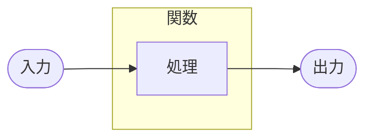
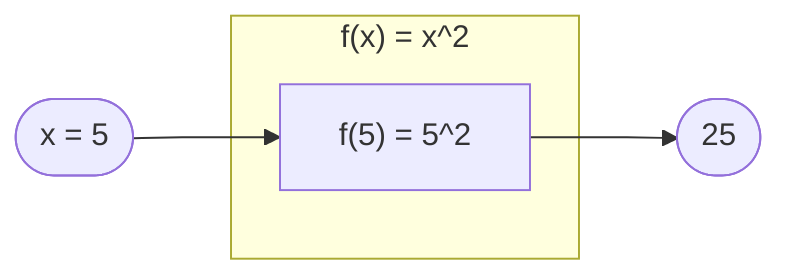

関数は主に、3つの要素から成り立っている。
- 入力値（引数）
- 処理
- 出力値（返り値）
大雑把に言えば、関数とは「なんか入れたら、なんやかんやあって、なんか出る」ものだ。

たとえば、入力値を2乗して出力する関数 $f(x) = x^2$ があるとする。この場合、3つの要素は次のようになる。
- 入力値：$x = 5$
- 処理：$f(5) = 5^2 = 25$
- 出力値：$25$