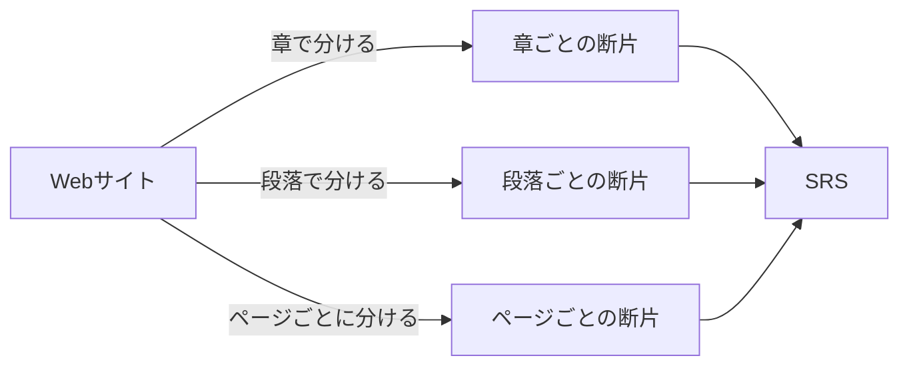
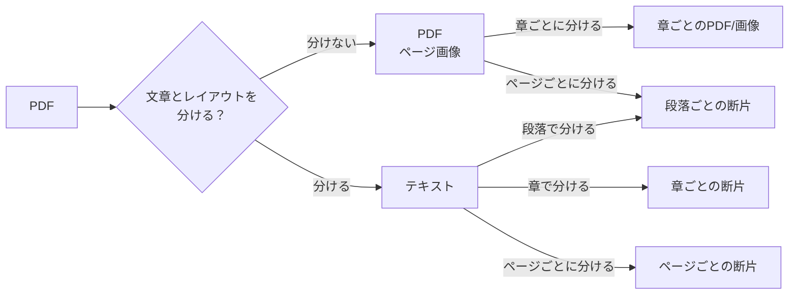

## Webサイトを分割する

ウェブサイトの内容を一定の区間ごとに分ける。分け方は自分の好きなものでよい。章ごと、段落ごと、ページごと、いずれでも。自分が読む上でちょうどいいところで区切っていく。

## PDFを分割する

PDFは文章と紙面レイアウトが一体になっている。そのため、PDFの表示をそのまま使うか、文章や図表だけ抽出して使うかで分け方が異なる。そこが厄介。個人的にはテキストの編集が楽になるので、テキストと図表の形式で取り込んだほうが良いとは思う。