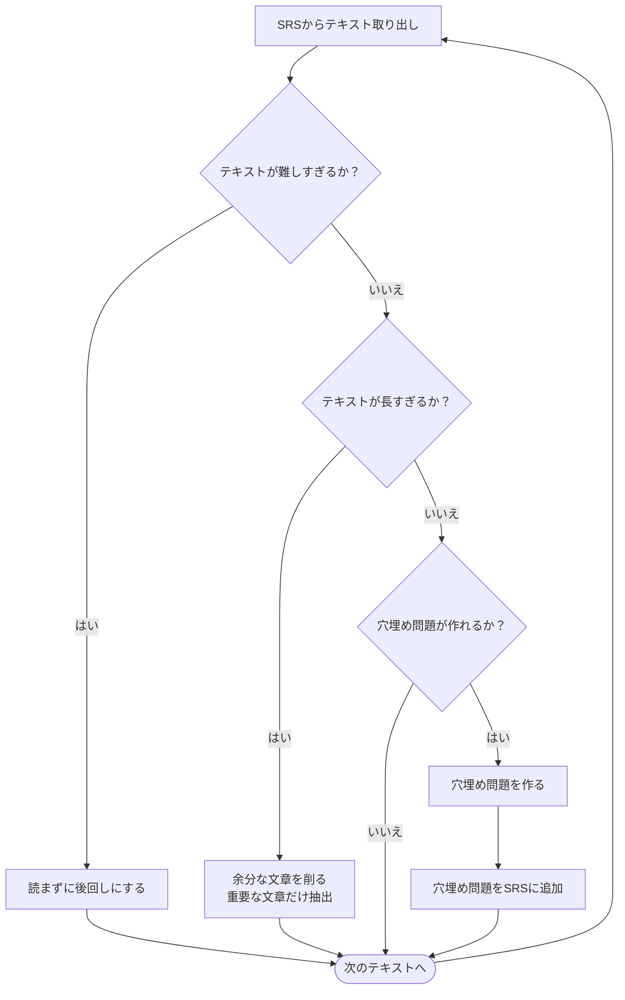

[[🧰Anki]]で本を読む際の手順。

## 前準備
まずは[[💭本をAnkiに突っ込む方法]]をもとに、書籍やPDF等をテキスト化してAnkiにインポートする。

## まずは、Ankiに表示された文章を読む
通常の読書では、本を読む前に「どの本を読むか」を決める工程がある。しかし[[📝Incremental Reading]]では、この選ぶ過程を[[📝Spaced Repetition System|SRS]]（Anki）にお任せする。Ankiで本を読むというのは、いわばAnkiに本を*読まされる*のと同じなのだ。

「そんなの読書じゃない」「その時その時に読みたい本を読むのが読書だろう」と思う人もいるかもしれない。実際、小説や漫画を読むなら、そのときの興味に従って読む方がいい。しかし、どんな本でもいっときの興味だけに任せればOKなのであれば、積読[^1]なんて言葉は存在しない。一番美味しいものだけ食べればOKなのであれば、人は肥満や高血圧になったりしない。

Ankiを使った読書法は、こうした従来の読書の欠陥を補ってくれる。つまり、その時点での自分の興味や関心・優先度といった判断基準が無視できるようになる。

テキストの難易度や文章量により、その後の行動は以下のように変わる。

### 文章が難しい！
おそらく、その文章を読むための知識、あるいは準備が足りていない。なので、その時が来るまで読み飛ばそう。Ankiでは「簡単」ボタンを押せば後回しができる。ただし、何度も読み飛ばしてしまうようなら、いっそカードを削除・休止するのも手だ。

### 文章が死ぬほど長い！
ひとつのカードに一章・一節ぶんのテキストを載せていると、この状態になる。この場合は、カードの内容を分割しよう。

長い文章には多くの場合、話題が2つ以上入っていたり、特に覚える必要のない具体例や、よもやま話が挟まっていたりする。こうした話の切れ目をひとつずつ、自分の感覚で切り分けていこう。一度で細かく分けようとせず、2〜4つほどに切り分けるのが望ましい。また、この切り分け作業は何度繰り返してもよい。自分にとって読みやすい文章量になるまでを目指そう。

### 読めるけど覚える必要のない文章が多い
テキストのなかに、著者の実例や具体例、あるいは昔話や自慢話が入っていると、この状態になる。覚える必要がないと判断した文章は思い切って削除しよう。一部どころか全部がいらない場合は、カードを削除するか休止してもいい。

### 文章量がちょうどいい
覚えたい項目を訪ねるような質問カードを作ろう。[[📝想起練習]]の研究によると、覚えるのに効果的なのは、一問一答形式らしい。（例：早押しクイズ）[[👤Piotr Wozniak]]氏は、質問カードを作るのが面倒くさい場合は、穴埋め問題を作ることをオススメしている。（[[💬穴埋め問題は手軽で効果的]]）

穴埋め問題を作り終えた読書カードは削除するか休止状態にしよう。

ちなみに、個人的には読書カードと質問カードは別のデッキにして分けると管理しやすい。（[[💭読書デッキと学習デッキを分ける]]）

[^1]: 買った本をそのまま読まずに積んでしまうこと。「積んどく」からのダジャレ。ちなみに電子書籍でも積読は発生する。"load"という意味では、データもまた積むものか。