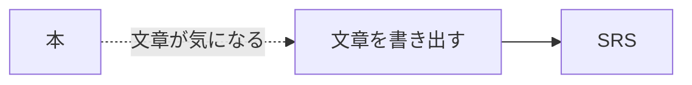
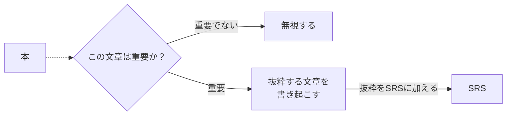
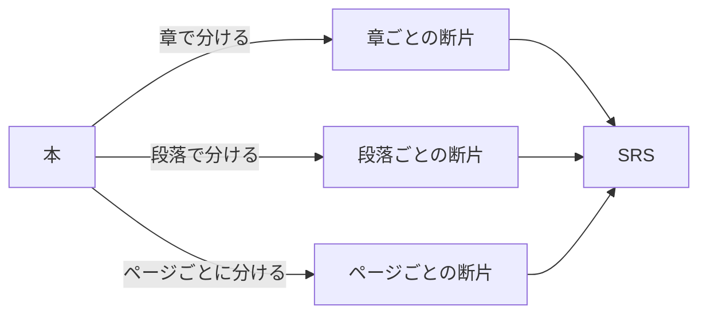

## ふだんの読書（Reading）の場合

まずは本を読む。本を読んでいると、気になる文章や重要そうな文章が見つかる。その文章を何かしらのメモに書き出す。もっとしっかり覚えたいという人は、その後、抜粋した文章をSRS（分散学習システム）に入れる。

### メタデータの取得が面倒
この方法には欠点がある。「抜粋した文章をSRSに入れる」という作業が重すぎるのだ。たとえば物理媒体の本の場合、本に書かれた文章をメモ帳に書き起こす必要がある。

とはいえ文字の書き起こし自体は、写真を撮るなり、OCRでテキストを抽出するなりすれば、楽にできる場合もある。

問題は、以下のようなデータも取り入れたい場合だ。書き起こした文章すべてにこれらのデータを逐一付与するのは、地味な割に骨が折れる。
- 奥付にあるデータ（題名、著者名、出版社、出版年など）
- その文章が書かれていたページ番号

### 読書メモを取る方法では「重要」と判断することが重荷になる

「気になった文章を抜粋する」作業は、読者が文章を読むたびに「この文章は重要か否か」を判断する必要がある。この判断自体はそこまで負担ではない。しかし、ここに「重要であれば文章を書き起こしてSRSに加える」という作業が合わさると、重要だと判断すること自体が重荷になる。

私の場合、抜粋作業の負荷が重ければ重いほど、だんだんと抜粋作業を行わなくなる（[[💭見よう見まねでIncremental Readingを数ヶ月続けた失敗談]]）。こうして、読書メモを作らないままにKindleのハイライトだけが増えていく。読書は受動的なものになる。

## Incremental Readingは本全体をSRSに格納する

Incremental Readingは、本の内容をいったんすべてSRSに加える。こうすると、「抜粋した文章をSRSに入れる」作業の負荷が軽くなる。抜粋したい文章自体がすでにSRSに入っているからだ。あとはSRS上で、いらない文章を削ったり、カードを複製して重要な点だけ抽出すればよい。

また、本をSRSに入れるという作業は機械的に処理できる。本は多くの場合、著者がすでに章や節、段落という形で内容を分けてくれている。どの粒度で分けるかは読者自身で決める必要はあるが、分け方さえ決まれば、あとは流れ作業でこなすことができる。（[[💭Incremental Readingで内容を分割する方法]]）
