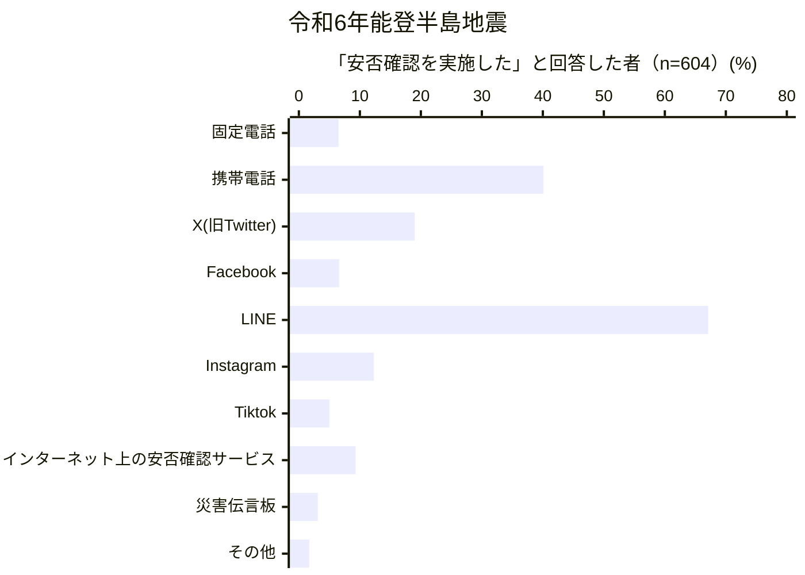
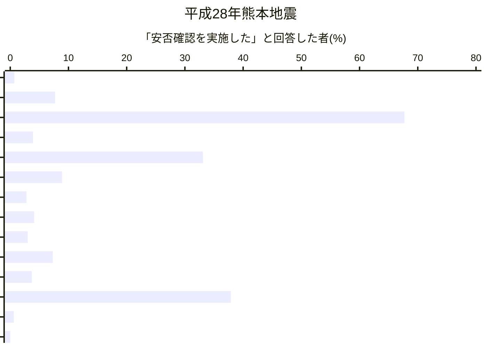

```mermaid
xychart-beta horizontal
    title "令和6年能登半島地震"
    x-axis ["固定電話", "携帯電話", "X(旧Twitter)", "Facebook", "LINE", "Instagram", "Tiktok", "インターネット上の安否確認サービス", "災害伝言板", "その他"]
    y-axis "「安否確認を実施した」と回答した者（n=604）(%)" 0 --> 80
    bar [6.5, 40.1, 19.0, 6.6, 67.1, 12.3, 5.0, 9.3, 3.1, 1.7]
```

```mermaid
xychart-beta horizontal
    title "平成28年熊本地震"
    x-axis ["公衆電話", "固定電話", "携帯電話", "インターネット電話(スカイプ等)", "携帯メール", "Twitter(政府・行政機関等)", "Twitter(家族・友人・知人等)", "LINE(政府・行政機関等)", "LINE(家族・友人・知人等)", "Instagram", "位置情報サービス(foursquare、ミクシィチェックイン等)", "インターネット上の安否確認サービス(Googleパーソンファインダー、Yahoo!安否確認サービス等)", "災害伝言板", "情報収集は実施しなかった"]
    y-axis "「安否確認を実施した」と回答した者(%)" 0 --> 80
    bar [0.7, 7.7, 67.7, 3.9, 33.1, 8.9, 2.8, 4.1, 3.0, 7.3, 3.7, 37.9, 0.6, 0.0, 0.6, 2.1, 1.9]
```