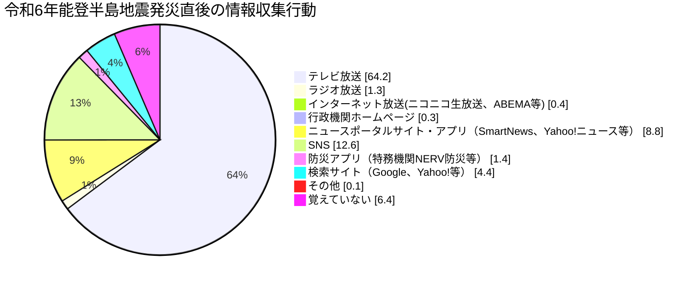

```mermaid
pie showData
    title 令和6年能登半島地震発災直後の情報収集行動
    "テレビ放送" : 64.2
    "ラジオ放送" : 1.3
    "インターネット放送(ニコニコ生放送、ABEMA等)" : 0.4
    "行政機関ホームページ" :  0.3
    "ニュースポータルサイト・アプリ（SmartNews、Yahoo!ニュース等）" : 8.8
    "SNS" : 12.6
    "防災アプリ（特務機関NERV防災等）" : 1.4
	"検索サイト（Google、Yahoo!等）" : 4.4
	"その他" : 0.1
	"覚えていない" : 6.4 
```
