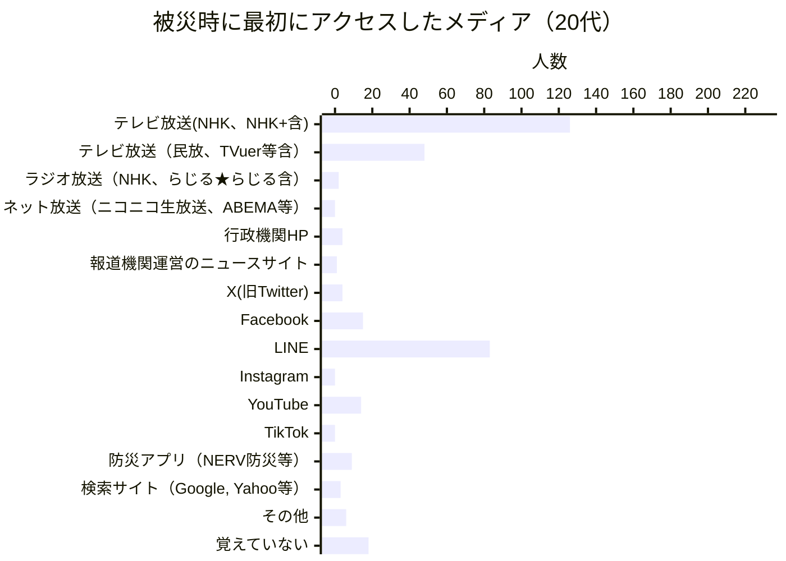
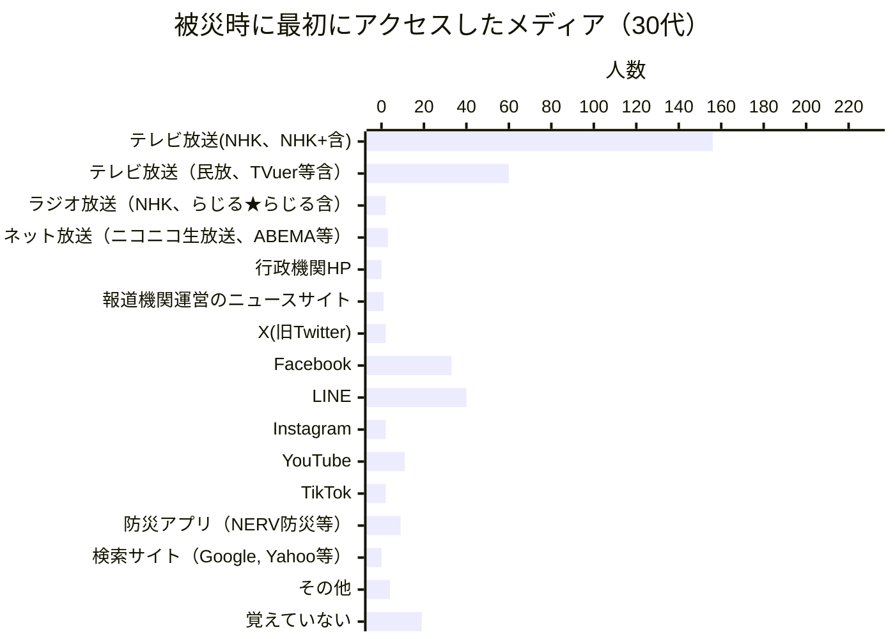
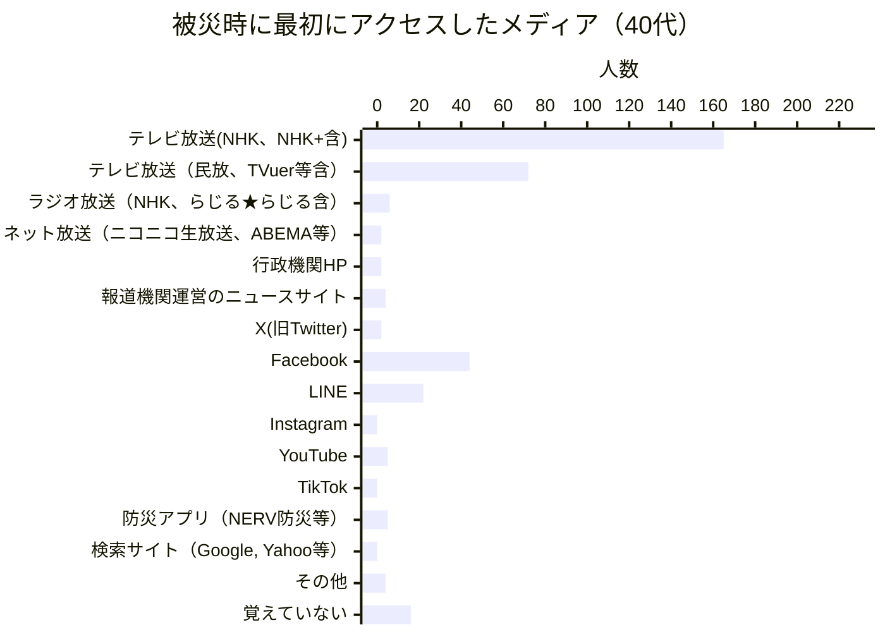
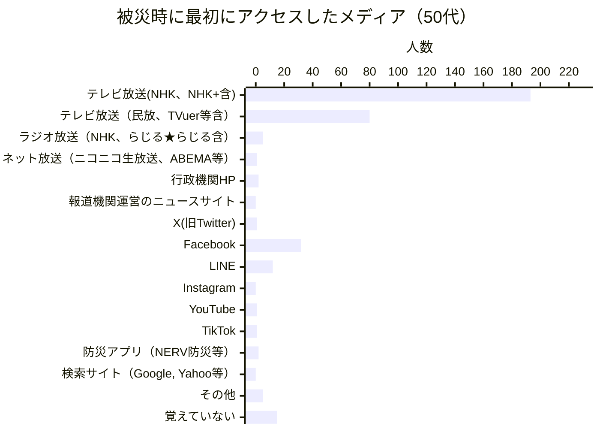
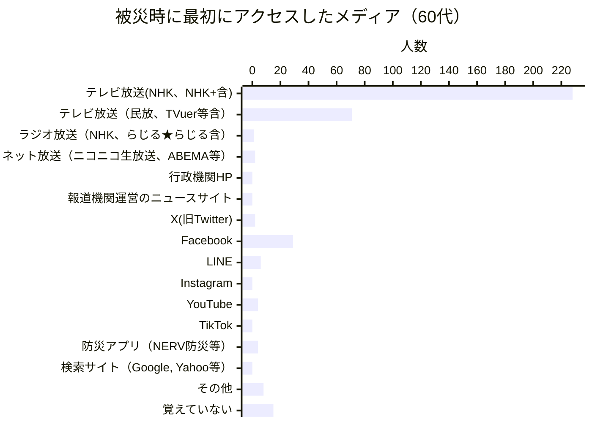

![[被災時に最初にアクセスしたメディア_表.png]]

```mermaid
xychart-beta horizontal
    title "被災時に最初にアクセスしたメディア（20代）"
    x-axis ["テレビ放送(NHK、NHK+含)", "テレビ放送（民放、TVuer等含）", "ラジオ放送（NHK、らじる★らじる含）", "ネット放送（ニコニコ生放送、ABEMA等）", "行政機関HP", "報道機関運営のニュースサイト", "X(旧Twitter)", "Facebook", "LINE", "Instagram", "YouTube", "TikTok", "防災アプリ（NERV防災等）", "検索サイト（Google, Yahoo等）", "その他", "覚えていない"]
    y-axis "人数" 0 --> 230
    bar [126, 48, 2, 0, 4, 1, 4, 15, 83, 0, 14, 0, 9, 3, 6, 18, 0, 24]
```

```mermaid
xychart-beta horizontal
    title "被災時に最初にアクセスしたメディア（30代）"
    x-axis ["テレビ放送(NHK、NHK+含)", "テレビ放送（民放、TVuer等含）", "ラジオ放送（NHK、らじる★らじる含）", "ネット放送（ニコニコ生放送、ABEMA等）", "行政機関HP", "報道機関運営のニュースサイト", "X(旧Twitter)", "Facebook", "LINE", "Instagram", "YouTube", "TikTok", "防災アプリ（NERV防災等）", "検索サイト（Google, Yahoo等）", "その他", "覚えていない"]
    y-axis "人数" 0 --> 230
    bar [156, 60, 2, 3, 0, 1, 2, 33, 40, 2, 11, 2, 9, 0, 4, 19, 1, 24]
```

```mermaid
xychart-beta horizontal
    title "被災時に最初にアクセスしたメディア（40代）"
    x-axis ["テレビ放送(NHK、NHK+含)", "テレビ放送（民放、TVuer等含）", "ラジオ放送（NHK、らじる★らじる含）", "ネット放送（ニコニコ生放送、ABEMA等）", "行政機関HP", "報道機関運営のニュースサイト", "X(旧Twitter)", "Facebook", "LINE", "Instagram", "YouTube", "TikTok", "防災アプリ（NERV防災等）", "検索サイト（Google, Yahoo等）", "その他", "覚えていない"]
    y-axis "人数" 0 --> 230
    bar [165, 72, 6, 2, 2, 4, 2, 44, 22, 0, 5, 0, 5, 0, 4, 16, 1, 27]
```

```mermaid
xychart-beta horizontal
    title "被災時に最初にアクセスしたメディア（50代）"
    x-axis ["テレビ放送(NHK、NHK+含)", "テレビ放送（民放、TVuer等含）", "ラジオ放送（NHK、らじる★らじる含）", "ネット放送（ニコニコ生放送、ABEMA等）", "行政機関HP", "報道機関運営のニュースサイト", "X(旧Twitter)", "Facebook", "LINE", "Instagram", "YouTube", "TikTok", "防災アプリ（NERV防災等）", "検索サイト（Google, Yahoo等）", "その他", "覚えていない"]
    y-axis "人数" 0 --> 230
    bar [193, 80, 5, 1, 2, 0, 1, 32, 12, 0, 1, 1, 2, 0, 5, 15, 0, 29]
```

```mermaid
xychart-beta horizontal
    title "被災時に最初にアクセスしたメディア（60代）"
    x-axis ["テレビ放送(NHK、NHK+含)", "テレビ放送（民放、TVuer等含）", "ラジオ放送（NHK、らじる★らじる含）", "ネット放送（ニコニコ生放送、ABEMA等）", "行政機関HP", "報道機関運営のニュースサイト", "X(旧Twitter)", "Facebook", "LINE", "Instagram", "YouTube", "TikTok", "防災アプリ（NERV防災等）", "検索サイト（Google, Yahoo等）", "その他", "覚えていない"]
    y-axis "人数" 0 --> 230
    bar [228, 71, 1, 2, 0, 0, 2, 29, 6, 0, 4, 0, 4, 0, 8, 15, 0, 16]
```
