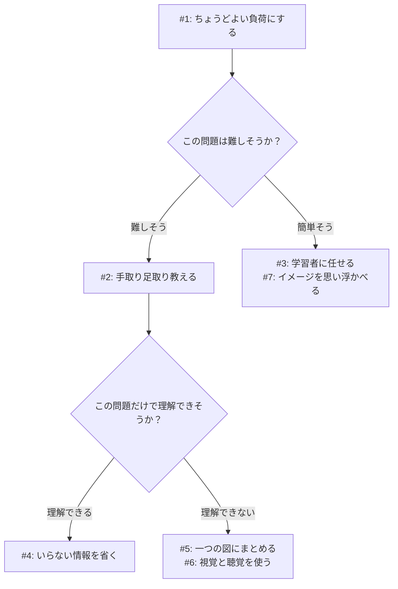

[[📝認知負荷]]を調節するための手順を教える冊子。2018年にCentre for Education Statistics and Evaluation[^1]が発行。

## 認知負荷への対応戦略

| No. | 戦略          | 関連する項目                         |
| --- | ----------- | ------------------------------ |
| 1   | ちょうどよい負荷にする | Element interactivity          |
| 2   | 手取り足取り教える   | [[📝解法つき例題]]                   |
| 3   | 学習者に任せる     | [[📝熟達化反転効果]]                  |
| 4   | いらない情報を省く   | Redundancy effect（冗長効果）        |
| 5   | 一つの図にまとめる   | Split-attention effect（分割注意効果） |
| 6   | 視覚と聴覚を使う    | Modality effect（モダリティ効果）       |
| 7   | イメージを思い浮かべる | Imagination effect             |

## 認知負荷管理のフローチャート

[^1]: オーストラリアのニューサウスウェールズ州にある教育機関と思われる。同州の教育省が管轄している組織？
