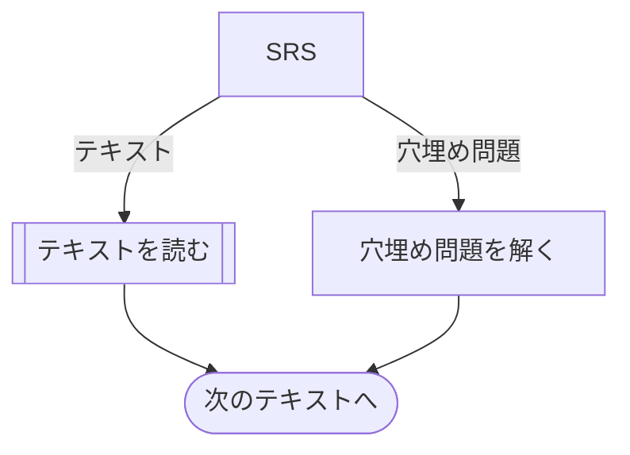
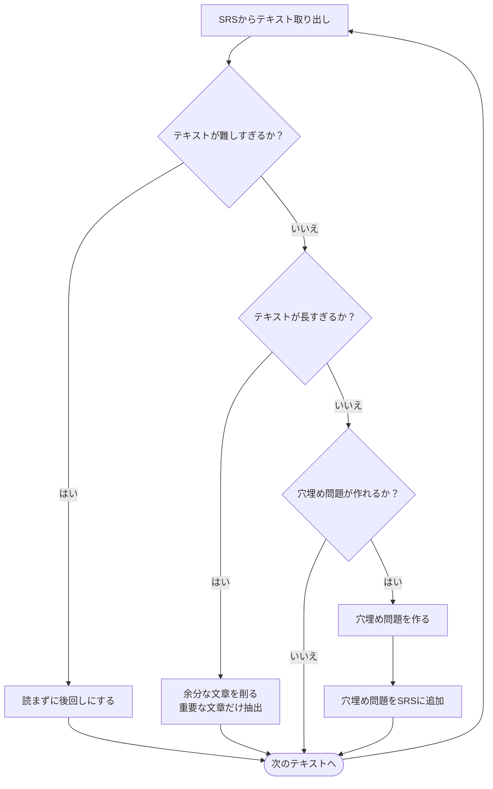

![[incremental reading.png]]
[[👤Piotr Wozniak]]氏が提唱する、読んだ本の内容を効率的に記憶するための手法。  ざっくり言うと、「本の中身を全部[[📝Spaced Repetition|SRS]]にぶっ込んで、重要なところを抽出しながら単語帳みたいに繰って読もうぜ」というもの。

抽出した文章は、[[📝Active recall]]で思い出せるように、[[💬穴埋め問題は手軽で効果的|穴埋めクイズ]]の形に昇華させるとなおよい。

[[👤Piotr Wozniak]]氏は[Incremental Readingで第二次世界大戦を学ぶ方法を説明する動画](https://www.youtube.com/watch?v=XRuLV2_A3Ts)で、Wikipediaを読みつつ穴埋め問題を作る、という形で進めていた。

## Incremental Readingの手順
ここでは分散学習システム（SRS）に[[🧰Anki]]を使う。

### Incremental Readingのフローチャート（最初）

SRSが格納しているテキストを表示する。表示したものが穴埋め問題であれば、単語帳アプリでやっていることと同じように、正答できるか確かめる。テキストであれば、[[#読書中のフローチャート]]に沿って読み進める。

### 読書中のフローチャート

表示されたテキストを読み進める。テキストが難しすぎるか、今は読まなくていいと思ったら、後回しにして次のテキストを読む。

文章の中には、内容を覚えるには文章量が多すぎるものもある。そこで重要な文章を抽出したカードを新しく作成する。[[🧰Anki]]の場合、カードを複製することである程度楽に抽出ができる。新しく作成したカードをSRSに追加したら、次のテキストを読む。

テキストの分割・抽出を繰り返すと、ちょうど良い長さのテキストが数多く生まれてくる。そこで今度は、テキストの内容にまつわる穴埋め問題を作る。テキストの内容をきちんと覚えているかどうか確認するためだ。作った問題はSRSに追加して、次のテキストを読む。

テキストの分割・抽出と、穴埋め問題の作成。この作業を時間をかけて繰り返し、本の内容を長期記憶として残す。それがIncremental Readingである。

## 長所
- 本の内容が記憶に残りやすい
	- ひとつの本や記事を長い時間をかけて読み進めるため
	- 何度も内容を復習する機会がある
- 複数の分野を並列して学習できる
	- 通常の読書は直列なので、初めに読んだものほど記憶が薄れる
- 教科書や事典ほど効果がある
	- 独立した項目が多いため、文章を細かく分けても支障がない
	- [[👤Piotr Wozniak]]氏はWikipediaを勧めている

## 短所
- ふだんの読書と比べて労力がかかる
	- 本を読むまでの前準備に時間がかかる
	- SuperMemoなら多少マシかもしれないが……
- 体系や一貫性を持った知識が得られないのではという懸念がある[^jonathan]
	- [[👤Piotr Wozniak]]氏は、逆に一貫した知識が得られるとしている
- 小説やエッセイには向かない
	- 小説やエッセイを楽しむにはワーキングメモリが多く必要
		- 間隔を空けすぎると登場人物や舞台を忘れてしまう
	- 娯楽はその場を楽しむためのもの
		- 長く覚えるものではない

[^jonathan]: たとえば、「[IRだと知識の一貫性が保てないのでは？](https://supermemopedia.com/wiki/Incremental_reading_and_interference)」。[「そんな方法で熟考できるの？」](https://supermemopedia.com/wiki/No_space_for_deep_reflection_in_incremental_reading)という意見。[[👤Piotr Wozniak]]氏はそれぞれに「テキストか穴埋め問題に矛盾があったら、取り組み中に違和感を覚えるはずだよ。その時は調査して間違っている方を削除したらいいよ」「むしろ熟考をサポートする仕組みだよ」と回答している。

## 参考
- [[💭通常の読書とIncremental Readingの違い]]
- [How to read a book in an hour? - YouTube](https://www.youtube.com/watch?v=saSFZGS-uCQ)
	- [[👤Piotr Wozniak]]氏によるIncremental Readingの実演動画（最新）