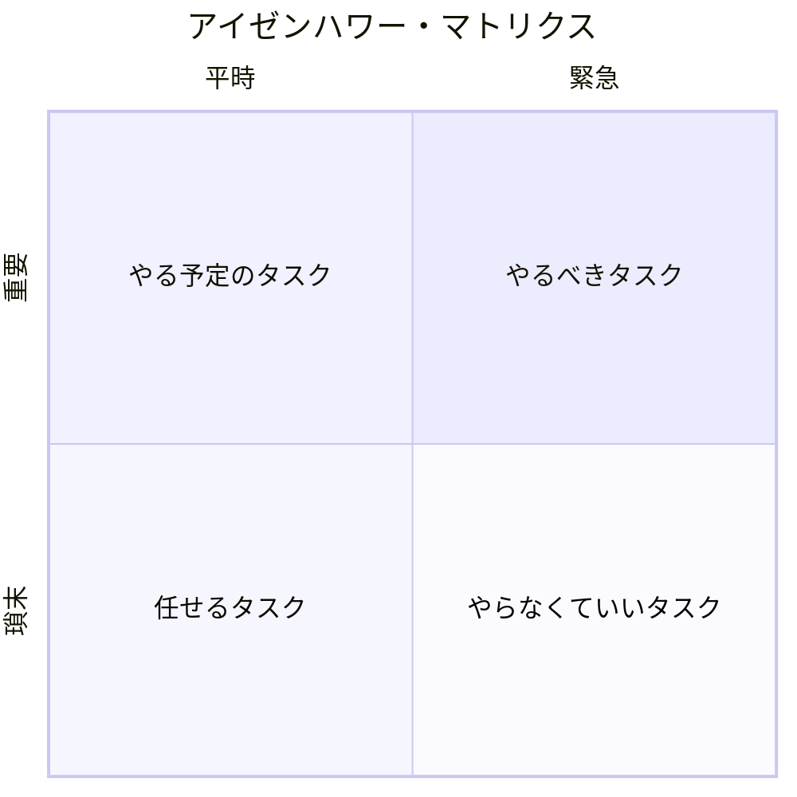

タスクを緊急度・重要度による4象限に分けることで、タスクの優先順位をつける手法。名前の由来はアメリカ大統領・アイゼンハワーの演説から。[^from]  
『7つの習慣』で取り上げられており、特に「重要だが緊急でない第二象限」に注視するべきと主張している。

[^from]: このマトリクスをアイゼンハワー氏自身が考案したかは不明。あくまでも演説中で引用した、以下の言葉がもとになっている。「私には2種類の問題がある。緊急なものと重要なものだ。緊急なものが重要であることはないし、重要なものが緊急であることはない」

タスク管理をせずにタスクを実行し続けていると、少しずつ「重要かつ緊急」タスクの比重が大きくなっていく。なぜそうなるか？　「重要だが緊急でない」タスクが、時間を経て締め切りに近づくことで、突然「重要かつ緊急」タスクに変貌するからだ。

## 参考
- [アイゼンハワーマトリクスの領域と実践時のコツを解説 \[2024\] • Asana](https://asana.com/ja/resources/eisenhower-matrix)