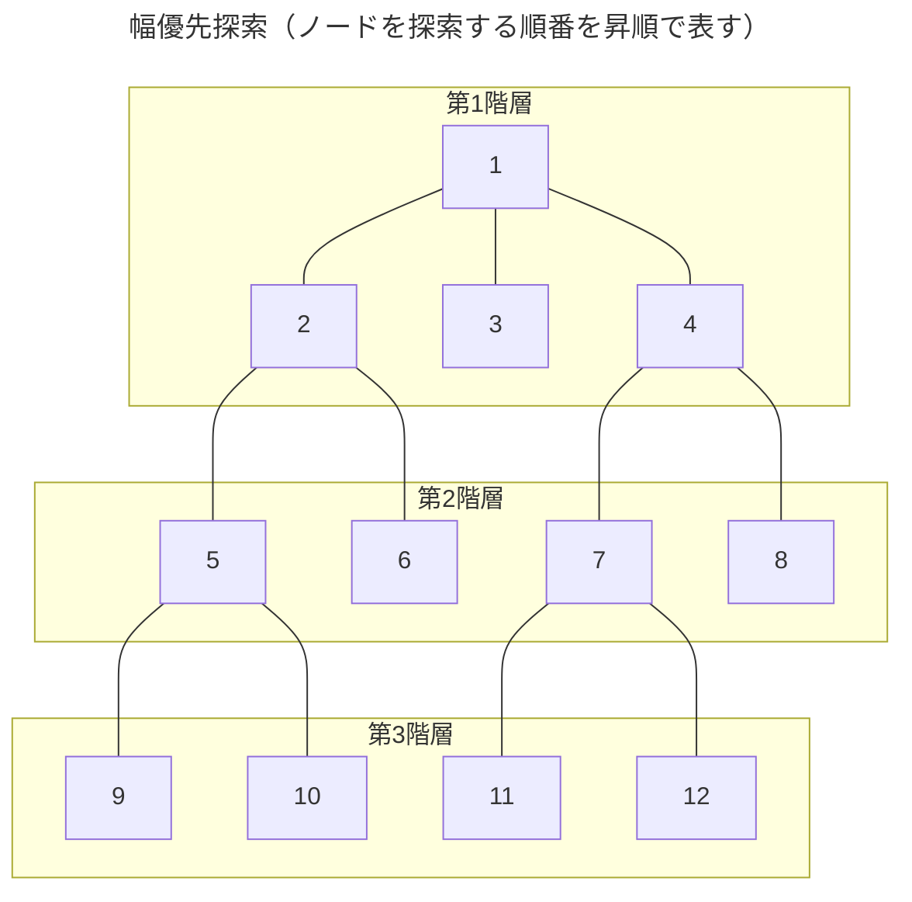

木構造を探索する手法のひとつ。横型探索とも呼ばれる。データ構造はキュー。
同じ階層にあるノード（＝対象に隣接するノード）からすべてなぞり、それから次の階層のノードを探索する。
たとえばハノイの塔において、ゴールまでの最短手順を見つけるのに使える。

## 時間計算量[^time]
$|V|$ は木構造グラフのノードの数、$|E|$ は木構造グラフの辺の数とする。
 $$O(|V|+|E|)$$
 
 最悪の場合はすべての経路を考える必要があるため。

[^time]: 「コンピュータが特定の手順に従って与えられた問題を解く際に必要とする手順の回数。これが少ないほど、より短い時間で問題を解くことができる。」（[時間計算量とは - IT用語辞典 e-Words](https://e-words.jp/w/%E6%99%82%E9%96%93%E8%A8%88%E7%AE%97%E9%87%8F.html)）単に計算量という場合は時間計算量を示す。

## 空間計算量[^space]
$|V|$ は木構造グラフのノードの数とする。
$$O(|V|)$$

[^space]: 「コンピュータが特定の手順に従って与えられた問題を解く際に必要とする記憶領域の容量。これが少ないほど、より少ないメモリ容量で問題を解くことができる。」（[空間計算量（領域計算量）とは - IT用語辞典 e-Words](https://e-words.jp/w/%E7%A9%BA%E9%96%93%E8%A8%88%E7%AE%97%E9%87%8F.html)）

## 参考
- [[📝深さ優先探索]]