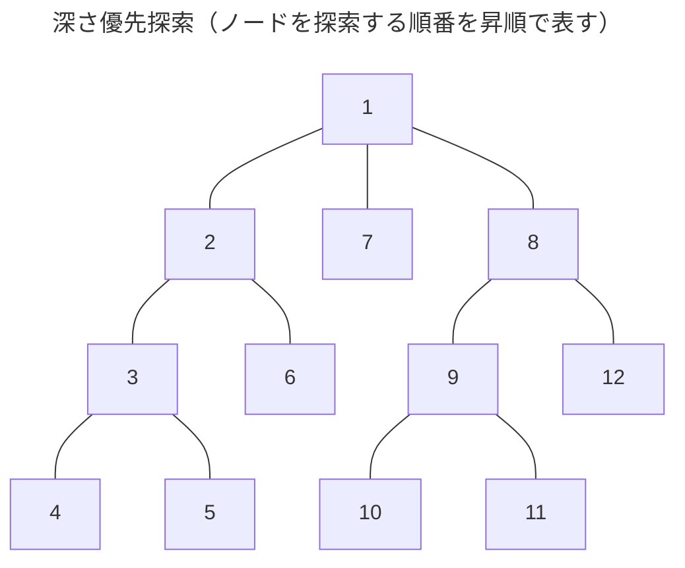

木構造を探索する手法のひとつ。縦型探索とも呼ばれる。データ構造はスタック。
行き止まりに突き当たるまでノードを探索する。行き止まりに来たらひとつ前のノードに戻る。その後、他の子ノードがあれがそこから突き進み、子ノードがなければさらにひとつ前のノードに戻る。これを繰り返す。

## 左手法（右手法）＝深さ優先探索
![[迷路と木構造.png]]

古典的な迷路の攻略法に左手法（右手法）がある。「迷路の左（または右）の壁をずっと触りながら進めば、ゴールにたどり着ける」というものだ。[^exception]これは深さ優先探索と同じだ。

[^exception]: この解法は「迷路の入り口と出口が一つの壁でつながっている」こと、つまり迷路が木構造になっていることが前提になっている。迷路の出口が迷路内部に存在する場合（≒木構造のノードの一部がつながり合って環になる場合）は出口にたどり着けない。

## 計算量
### 時間計算量[^time]
$|V|$ は木構造グラフのノードの数、$|E|$ は木構造グラフの辺の数とする。
 $$O(|V|+|E|)$$
 
 最悪の場合はすべての経路を考える必要があるため。

[^time]: 「コンピュータが特定の手順に従って与えられた問題を解く際に必要とする手順の回数。これが少ないほど、より短い時間で問題を解くことができる。」（[時間計算量とは - IT用語辞典 e-Words](https://e-words.jp/w/%E6%99%82%E9%96%93%E8%A8%88%E7%AE%97%E9%87%8F.html)）単に計算量という場合は時間計算量を示す。

### 空間計算量[^space]
$|V|$ は木構造グラフのノードの数とする。
$$O(|V|)$$

[^space]: 「コンピュータが特定の手順に従って与えられた問題を解く際に必要とする記憶領域の容量。これが少ないほど、より少ないメモリ容量で問題を解くことができる。」（[空間計算量（領域計算量）とは - IT用語辞典 e-Words](https://e-words.jp/w/%E7%A9%BA%E9%96%93%E8%A8%88%E7%AE%97%E9%87%8F.html)）

## 参考
- [[📝幅優先探索]]