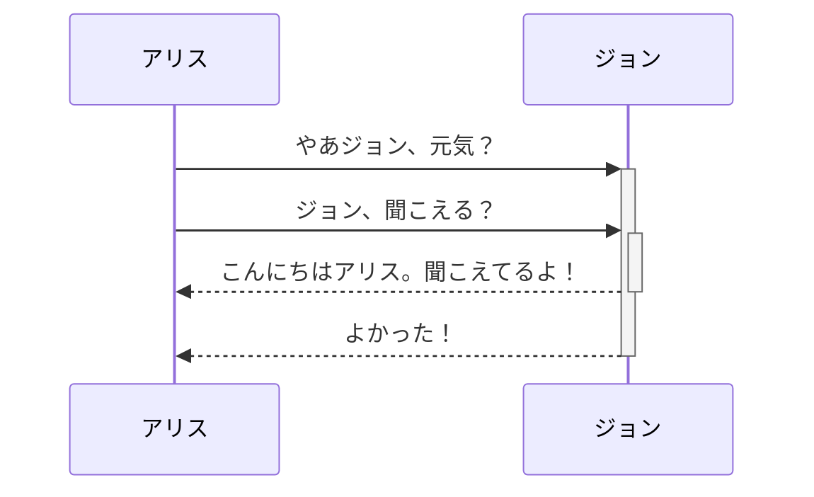

>[!caution] PopOver機能が有効だと同じページ内のリンク遷移に失敗する
>QuartzにてPopOver機能を有効にしていると、ページ内リンクがうまくいかなくなる。Quartzの不具合らしい。[^目次が利用できない]

[^目次が利用できない]: [Popovers cause anchors that go to headers further down on the same page to break · Issue #890 · jackyzha0/quartz · GitHub](https://github.com/jackyzha0/quartz/issues/890)および、[Popover does not recognize Wikilinks anchors containing Japanese text · Issue #1155 · jackyzha0/quartz · GitHub](https://github.com/jackyzha0/quartz/issues/1155)を参照。

## 目次
- [[#見出し]]
- [[#箇条書きリスト]]
- [[#番号付きリスト]]
- [[#タスクリスト]]
- [[#引用]]
- [[#脚注]]
- [[#数学]]
- [[#code記法]]
- [[#pre記法]]
- [[#pre記法(シンタックスハイライト)]]
- [[#コメント]]
- [[#斜体(イタリック)]]
- [[#強調]]
- [[#強調+斜体]]
- [[#取り消し線]]
- [[#ハイライト]]
- [[#水平線]]
- [[🧰マークダウン記法#リンク|リンク]]
- [[#表組(テーブル)]]
- [[#ページ内リンク]]
- [[#ページ内ブロックリンク]]
- [[#ダイアグラム]]
___
## 見出し

```
# 見出し1
## 見出し2
### 見出し3
#### 見出し4
##### 見出し5
###### 見出し6
```

# 見出し1
## 見出し2
### 見出し3
#### 見出し4
##### 見出し5
###### 見出し6
___
## 箇条書きリスト

```
- リスト1
	- ネスト リスト1_1
		- ネスト リスト1_1_1
		- ネスト リスト1_1_2
	- ネスト リスト1_2
+ リスト2
* リスト3
```

- リスト1
	- ネスト リスト1_1
		- ネスト リスト1_1_1
		- ネスト リスト1_1_2
	- ネスト リスト1_2
+ リスト2
* リスト3
___
## 番号付きリスト

```
1. 番号付きリスト1
	1. 番号付きリスト1_1
	2. 番号付きリスト1_2
2. 番号付きリスト2
3. 番号付きリスト3
```
1. 番号付きリスト1
	1. 番号付きリスト1_1
	2. 番号付きリスト1_2
2. 番号付きリスト2
3. 番号付きリスト3
___
## タスクリスト
``` 
- [x] これは完了したアイテムです。
- [?] これも同様に完了したアイテムです(あらゆる文字で機能します)。 
- [ ] これは未完了のアイテムです。 
- [ ] タスクはプレビューモードでクリックするとチェックオフできます。
```
- [x] これは完了したアイテムです。
- [?] これも同様に完了したアイテムです(あらゆる文字で機能します)。 
- [ ] これは未完了のアイテムです。 
- [ ] タスクはプレビューモードでクリックするとチェックオフできます。
___
## 引用
```
> 引用文
>> 二重引用文
```
> 引用文
>> 二重引用文
___
## 脚注
段落を一行空けることも重要。
>[!caution] 識別子は半角英数字で
>Quartzを使う場合、脚注の識別子は半角英数字で書く方がよさそう。日本語で書くと脚注へのアンカーリンクが動かなくなる。

```
ここにシンプルな脚注[^1] と長い段落があります。[^bignote] 

[^1]: シンプルな脚注です。
[^bignote]: ここに多数のパラグラフとコードの脚注があります。 
    脚注に段落を挿入するには段落をインデントしてください。 
    
    `{ my code }` 
    
    好きなだけ段落を追加してください。
```
ここにシンプルな脚注[^1] と長い段落があります。[^bignote] 

[^1]: シンプルな脚注です。
[^bignote]: ここに多数のパラグラフとコードの脚注があります。 
    脚注に段落を挿入するには段落をインデントしてください。 
    `{ my code }` 
    好きなだけ段落を追加してください。
___
## 数学 
^e97ad5
>[!note] 原則的にはpre記法に似た形で書くこと
>`$$`を使う場合は、以下の例に書かれているように、上下を`$$`行で囲むように使うこと。Obsidian上では改行しなくても使えるが、Quartzでは改行しておかないとParse Errorが発生する。

記号の書き方は[MathJax](https://www.eng.niigata-u.ac.jp/~nomoto/download/mathjax.pdf)を参照。
```
$$
\begin{vmatrix}
a & b\\
c & d 
\end{vmatrix}=ad-bc
$$
```
$$
\begin{vmatrix}
a & b\\
c & d 
\end{vmatrix}=ad-bc
$$
___
## code記法
```
パッケージをアップグレードするときは `apt upgrade` とコマンドを打ってね
```
パッケージをアップグレードするときは `apt upgrade` とコマンドを打ってね
___
## pre記法
チルダorバッククォート3個、またはスペースorタブ4個
````
~~~
# チルダ
#!/usr/bin/bash
ls | grep hoge
~~~
```
# バッククオート
#!/usr/bin/bash
ls | grep hoge
```
    # スペースorタブ
    #!/usr/bin/bash
    ls | grep hoge
````

~~~
# チルダ
#!/usr/bin/bash
ls | grep hoge
~~~
```
# バッククオート
#!/usr/bin/bash
ls | grep hoge
```
    # スペースorタブ
    #!/usr/bin/bash
    ls | grep hoge
---
## pre記法(シンタックスハイライト)
pre記法の後ろに対象シンタックスの言語名を記述する
````
~~~ruby
class Hoge
　def hoge
　  print 'hoge'
　end
end
~~~
````

~~~ruby
class Hoge
　def hoge
　  print 'hoge'
　end
end
~~~

---
## コメント
>[!info] Quartz上では見えません
>以下の例文には、「このテキストは見えません」という旨のコメントを載せていますが、本ページ上では確認できません。ご了承ください。

```
これがインラインコメント: %%このテキストは見えません%% (見えません)
これがブロックコメント: 
%% 
この
複数行は
読めません
%%
```
これがインラインコメント: %%このテキストは見えません%% (見えません)
これがブロックコメント: 
%% 
この
複数行は
読めません
%%
___
## 斜体(イタリック)
```
normal *italic*  
normal _italic_
```
normal *italic*  
normal _italic_
___
## 強調
```
normal **bold**  
normal __bold__
```
normal **bold**  
normal __bold__
___
## 強調+斜体
```
normal ***bold + italic***  
normal ___italic + italic___
```
normal ***bold + italic***  
normal ___italic + italic___
___
## 取り消し線
```
~~取り消し線~~
```
~~取り消し線~~
___
## ハイライト
```
2つのイコール記号を使うと==テキストをハイライト==できます。
```
2つのイコール記号を使うと==テキストをハイライト==できます。
___
## 水平線
```
___
***
---
- - -
```
___
***
---
- - -
___
## リンク
```
[マークダウン記法の参考URL](http://www.ep.sci.hokudai.ac.jp/~ymoteki/contents/markdown.html)
```
[マークダウン記法](http://www.ep.sci.hokudai.ac.jp/~ymoteki/contents/markdown.html)
___
## 表組(テーブル)
```
|header1|header2|header3|
|:--|:--:|--:|
|align left|align center|align right|
|a|b|c|
```
| header1    |   header2    |     header3 |
|:---------- |:------------:| -----------:|
| align left | align center | align right |
| a          |      b       |           c |
___ 
## ページ内リンク
^089a3f
>[!note] Quartz上では記述が変わる
>以下の例は、Quartzが変換過程でテキストを変えているようです。サイト上では`#目次|目次`と表示されていますが、実際のObsidianでは`#目次`と書いています。

```
- [[#目次]]
- [[#ページ内リンク]]
```
- [[#目次]]
- [[#ページ内リンク]]

___
## ページ内ブロックリンク
あるノート内の特定ブロックとリンクを結びたい場合は、リンクの末尾に`#^`と加える。`^`と入力すれば候補がサジェストされるので、IDを覚えておく必要はない。 ^block-link-example
- [[🧰マークダウン記法#^089a3f]]（「ページ内リンク」ヘッダーへのリンク）
- [マークダウン記法の数学へのリンク](🧰マークダウン記法#^e97ad5)

ユーザが独自にID名を決めることもできる。たとえば文章の末尾に` ^(半角英数字で好きな文章を入力)`と加えておき、リンクの末尾に`#^(先で設定したID名)`を加えると、設定したID名のブロックとリンクを結ぶことができる。
なお、日本語でID名を設定することはできない。
- [[🧰マークダウン記法#^block-link-example]]
- [block-link-exampleへのリンク](🧰マークダウン記法#^block-link-example)

### ブロックの埋め込み
また、ブロックの前に`!`を使うことでブロックを埋め込むこともできる。
>[!note] リンク先が存在しない場合
>リンク先が存在しない場合は、`[Transclude of 🧰Obsidian#^d7df7d]`といったハイパーリンクのみが表示される。

```
![[🧰Obsidian#^d7df7d]]
```
![[🧰Obsidian#^d7df7d]]

___
## ダイアグラム
[[🧰Mermaid]]を利用してダイアグラムやチャートも描画できる。Obsidian専用。[[#pre記法]]で囲んで使用する。

~~~

~~~

